# RuntimeShield

**Cross-Platform Runtime Protection Framework for Native Applications**

[](https://github.com/swadhingoswami/RuntimeShield/actions/workflows/ci.yml)
[](https://rust-lang.org)
[](LICENSE)
-success)


---

RuntimeShield is a modular SDK that native applications embed to verify their own integrity, detect runtime tampering, and respond through configurable policies. It is **not** an antivirus, anti-cheat, or DRM system — it is an integrity verification framework designed for clean integration.

```rust
let mut shield = RuntimeShield::builder()
    .enable_startup_verification()
    .enable_runtime_monitor()
    .enable_binary_integrity()
    .enable_library_integrity()
    .enable_memory_integrity()
    .enable_anti_debug()
    .on_event(Arc::new(|event| { /* handle event */ }))
    .build()?;
shield.start()?;
```

---

## Architecture

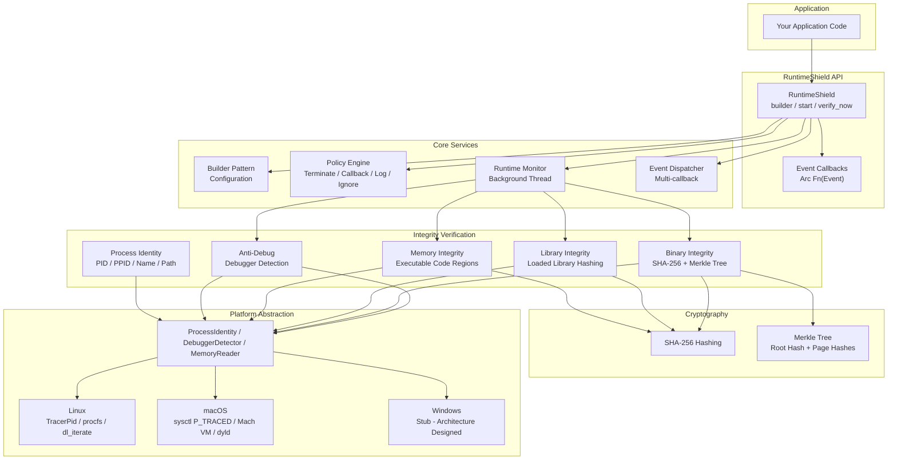

---

## How It Works

### Verification Pipeline

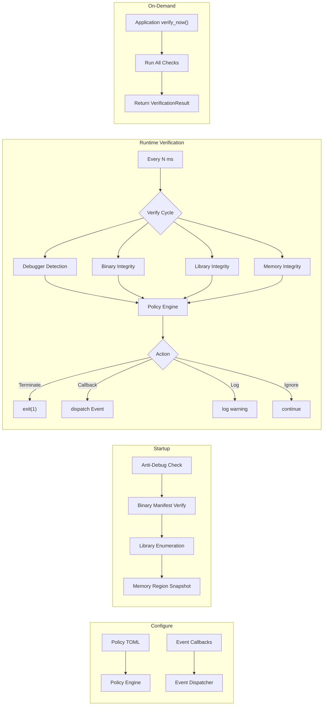

### Threading Model

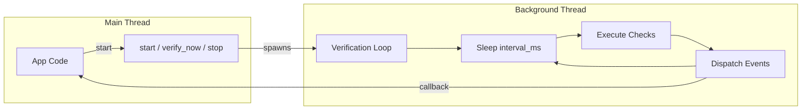

**Synchronization:** No shared mutable state. Verification modules are cloned at startup. Events use `Arc<dyn Fn(Event) + Send + Sync>`.

---

## Three Verification Modes

RuntimeShield provides three distinct ways to verify integrity. You can use any combination of them.

| Mode | When It Runs | Thread | Trigger | Best For |
|---|---|---|---|---|
| **Startup Verification** | Once, inside `start()` | Main thread (blocking) | Automatic | Catching tampering before any logic runs |
| **Runtime Monitor** | Every N milliseconds | Background thread (non-blocking) | Automatic | Continuous protection during execution |
| **On-Demand** | When called | Caller's thread (blocking) | Application calls `verify_now()` | Before sensitive operations (payments, crypto, auth) |

### 1. Startup Verification (runs once at start)

```rust
shield.start();
// Inside start():
//   1. Check TracerPid / P_TRACED         ← main thread, blocking
//   2. Verify binary hash against manifest  ← main thread, blocking
//   3. Enumerate and hash loaded libraries  ← main thread, blocking
//   4. Snapshot memory regions              ← main thread, blocking
//   5. If any check fails → policy action
```

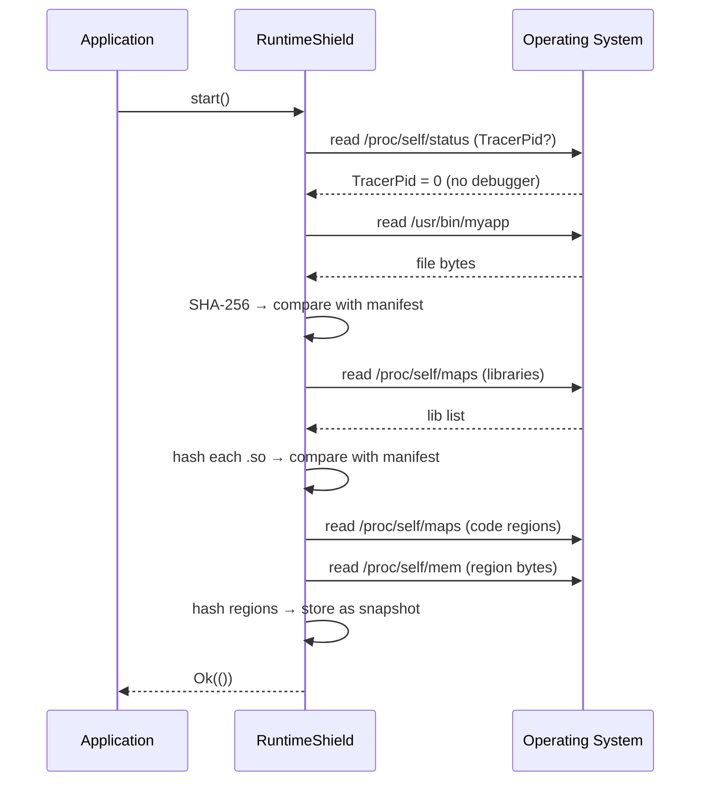

### 2. Runtime Monitor (background thread, periodic)

```rust
// In background thread (spawned by start() if runtime_monitor enabled):
loop {
    sleep(monitor_interval_ms);        // default: 5000ms, change with .monitor_interval()
    dispatch(VerificationStarted);

    // All checks run in this background thread
    if debugger_present() { dispatch(DebuggerDetected); policy.evaluate(); }
    if binary_modified()  { dispatch(BinaryModified);   policy.evaluate(); }
    if library_changed()  { dispatch(LibraryModified);  policy.evaluate(); }
    if memory_altered()   { dispatch(MemoryIntegrityFailed); policy.evaluate(); }

    dispatch(VerificationCompleted);
}
```

```mermaid
flowchart TB
    subgraph "Main Application Thread"
        A["Your app logic"]
    end

    subgraph "RuntimeShield Background Thread"
        B["Start"]
        C["Sleep 5000ms"]
        D["Anti-Debug check"]
        E{"Debugger?"}
        F["Binary integrity check"]
        G{"Modified?"}
        H["Library integrity check"]
        I{"Modified?"}
        J["Memory integrity check"]
        K{"Modified?"}
        L["Dispatch event to callback"]
    end

    A -->|start()| B
    B --> C
    C --> D
    D --> E
    E -->|No| F
    E -->|Yes| L
    F --> G
    G -->|No| H
    G -->|Yes| L
    H --> I
    I -->|No| J
    I -->|Yes| L
    J --> K
    K -->|No| C
    K -->|Yes| L
    L --> C
```

### 3. On-Demand Verification (application-triggered)

```rust
// Called by the application whenever needed — blocks until complete
let result = shield.verify_now()?;

// Returns immediately with a full status report
if !result.is_integrity_ok() {
    // Handle violation
}
```

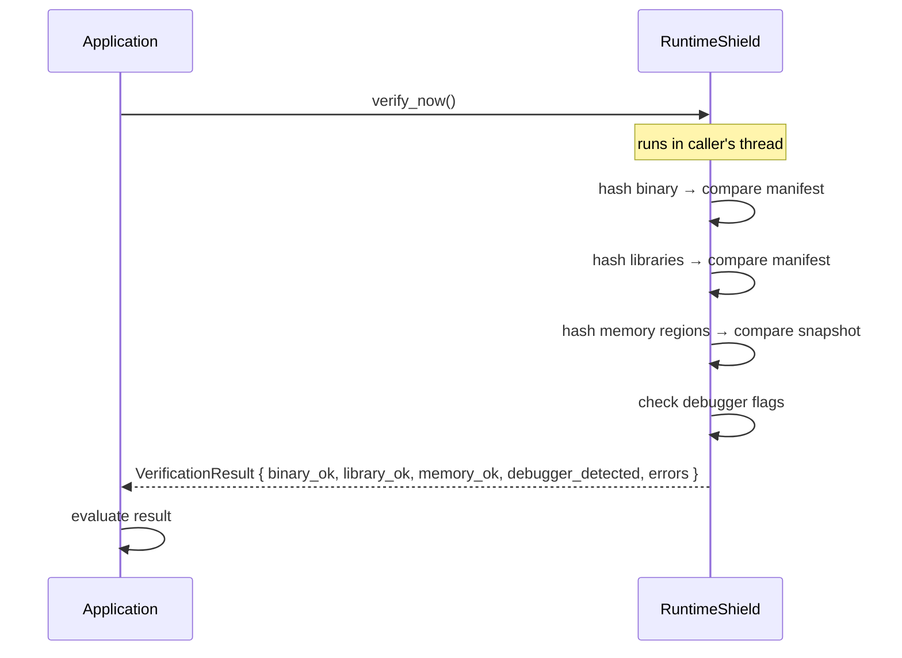

### Which Mode Should You Use?

| Use Case | Recommended Mode |
|---|---|
| I want protection from the moment my app starts | Startup + Runtime Monitor |
| I only care about specific operations (payments, crypto) | Startup + On-Demand |
| I want continuous protection with no delay | Startup + Runtime Monitor (1s interval) |
| I have limited CPU budget | Startup + On-Demand (check before key ops) |
| I'm wrapping an existing binary with LD_PRELOAD | Runtime Monitor |
| I'm debugging my own app | On-Demand only (check manually) |

All three modes can be combined freely. Enable what you need, skip what you don't.

### Runtime Monitor Interval Configuration

The background thread's verification interval is configurable from the builder:

```rust
RuntimeShield::builder()
    .enable_runtime_monitor()
    .monitor_interval(1000)   // aggressive: check every 1 second
    .monitor_interval(5000)   // default if not set
    .monitor_interval(30000)  // relaxed: check every 30 seconds
    .monitor_interval(60000)  // minimal: check every 60 seconds
    .build()?;
```

The interval is in milliseconds. Lower values catch tampering faster but consume more CPU. Higher values save CPU but leave longer windows of vulnerability between checks.

| Interval | CPU Impact | Detection Window | Best For |
|---|---|---|---|
| 1,000ms (1s) | ~2-5% per core | < 1 second | High-security, sensitive apps |
| 5,000ms (5s) | ~0.5-1% per core | < 5 seconds | Default — general purpose |
| 30,000ms (30s) | ~0.1% per core | < 30 seconds | Server apps, background services |
| 60,000ms (60s) | ~0.05% per core | < 60 seconds | Low-power, embedded, or batch |

---

## Platform Implementation

### Linux
| Feature | Technique | Source |
|---|---|---|
| Process Identity | `/proc/self/status`, `/proc/self/exe` | `src/platform/linux/` |
| Debugger Detection | `TracerPid` in `/proc/self/status` | `debugger.rs` |
| Memory Regions | `/proc/self/maps` + `/proc/self/mem` | `memory.rs` |
| Library Enumeration | `/proc/self/maps` parsing (.so paths) | `integrity/library.rs` |

### macOS
| Feature | Technique | Source |
|---|---|---|
| Process Identity | `proc_name()`, `_NSGetExecutablePath()`, `getppid()` | `src/platform/macos/` |
| Debugger Detection | `sysctl` with `KERN_PROC` + `P_TRACED` flag | `debugger.rs` |
| Memory Regions | `mach_vm_region_recurse()` + `mach_vm_read()` | `memory.rs` |
| Library Enumeration | `_dyld_image_count()` + `_dyld_get_image_name()` | `integrity/library.rs` |

### Windows
Architecture designed, implementation deferred. Trait implementations in `src/platform/windows/` are stubs ready for:
- `IsDebuggerPresent()` / `NtQueryInformationProcess` for anti-debug
- `VirtualQueryEx` / `ReadProcessMemory` for memory integrity
- `EnumProcessModules` for library enumeration
- `GetModuleFileName` / `GetCurrentProcessId` for process identity

---

## Language-Agnostic Protection

RuntimeShield works with **any language or binary format** — it operates at the file system and process memory level, reading raw bytes and OS structures, not source code. Your binary could be compiled from C, C++, Go, Rust, Zig, Nim, Python (compiled), C# (NativeAOT), Java (GraalVM), or any other language.

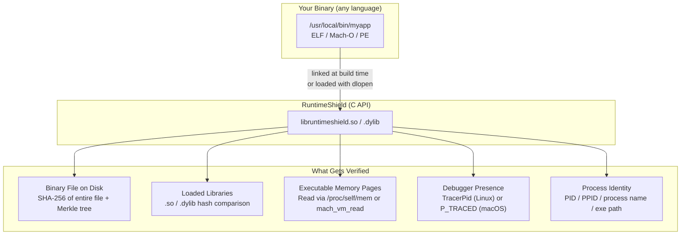

### How to Wrap Any Binary

There are **three integration strategies** — choose the one that fits your deployment:

#### Strategy 1: Link at Build Time (Best for C/C++/Go/Rust)

Compile RuntimeShield as a static or dynamic library and link it into your application at build time. The library initializes inside your process.

```bash
# 1. Build RuntimeShield
cargo build --release
# → target/release/libruntimeshield.a (static)
# → target/release/libruntimeshield.dylib (dynamic)

# 2. Link with your binary
# C/C++:
gcc -o myapp myapp.c -L./target/release -lruntimeshield
# Go (with cgo):
CGO_LDFLAGS="-L./target/release -lruntimeshield" go build
# Rust:
# Just add runtimeshield as a crate dependency
```

```c
// C/C++ integration
#include "runtimeshield.h"

int main() {
    rt_shield_t* shield = rt_shield_new();
    rt_shield_enable_binary_integrity(shield);
    rt_shield_enable_anti_debug(shield);
    rt_shield_enable_runtime_monitor(shield);
    rt_shield_set_monitor_interval(shield, 10000);
    rt_shield_on_event(shield, my_event_handler);

    if (rt_shield_start(shield) != 0) {
        fprintf(stderr, "RuntimeShield failed to start\n");
        return 1;
    }

    // Your application logic here
    run_my_app();

    rt_shield_stop(shield);
    rt_shield_free(shield);
    return 0;
}
```

#### Strategy 2: dlopen at Runtime (No Build Changes)

Load RuntimeShield at runtime using `dlopen` / `dlsym`. No recompilation or relinking of your existing binary is needed — perfect for wrapping binaries you didn't write.

```c
// wrapper.c — compile separately, inject via LD_PRELOAD
#include <dlfcn.h>
#include <stdio.h>

typedef struct rt_shield_t rt_shield_t;
typedef rt_shield_t* (*new_fn_t)();
typedef int (*start_fn_t)(rt_shield_t*);

int __attribute__((constructor)) shield_init() {
    void* handle = dlopen("./libruntimeshield.so", RTLD_NOW | RTLD_GLOBAL);
    if (!handle) { fprintf(stderr, "dlopen: %s\n", dlerror()); return 1; }

    new_fn_t new_fn = (new_fn_t)dlsym(handle, "rt_shield_new");
    start_fn_t start_fn = (start_fn_t)dlsym(handle, "rt_shield_start");

    rt_shield_t* shield = new_fn();
    return start_fn(shield);
}
```

```bash
# Compile the wrapper
gcc -shared -fPIC -o shield_wrapper.so wrapper.c -ldl

# Run ANY binary with RuntimeShield injected
LD_PRELOAD=./shield_wrapper.so ./myapp
# → myapp runs with integrity monitoring, no source changes needed
```

#### Strategy 3: Language-Specific Bindings (Python, C#, Node.js, Java)

Each language uses its own FFI mechanism to call the C API.

| Language | Mechanism | Example |
|---|---|---|
| **Python** | `ctypes.cdll.LoadLibrary("libruntimeshield.so")` | `shield = lib.rt_shield_new()` |
| **Go** | `import "C"` with cgo | `C.rt_shield_start(shield)` |
| **C#** | `[DllImport("libruntimeshield")]` | `rt_shield_start(shield)` |
| **Node.js** | `ffi-napi` Library | `lib.rt_shield_start(shield)` |
| **Java** | JNI or JNA | `Native.load("runtimeshield", RtShield.class)` |
| **Zig** | `@cImport` | `rt_shield_start(shield)` |

### Complete C API Reference

```c
// ─── Lifecycle ───────────────────────────────────────────
rt_shield_t* rt_shield_new(void);
void         rt_shield_free(rt_shield_t* shield);

// ─── Feature Toggles ─────────────────────────────────────
void rt_shield_enable_startup_verification(rt_shield_t* shield);
void rt_shield_enable_runtime_monitor(rt_shield_t* shield);
void rt_shield_enable_binary_integrity(rt_shield_t* shield);
void rt_shield_enable_library_integrity(rt_shield_t* shield);
void rt_shield_enable_memory_integrity(rt_shield_t* shield);
void rt_shield_enable_anti_debug(rt_shield_t* shield);

// ─── Configuration ───────────────────────────────────────
void rt_shield_set_monitor_interval(rt_shield_t* shield, uint64_t millis);
void rt_shield_set_policy_path(rt_shield_t* shield, const char* path);
void rt_shield_set_manifest_path(rt_shield_t* shield, const char* path);

// ─── Events ──────────────────────────────────────────────
typedef void (*rt_event_callback_t)(int event_type, const char* message);
void rt_shield_on_event(rt_shield_t* shield, rt_event_callback_t cb);

// ─── Control ─────────────────────────────────────────────
int  rt_shield_start(rt_shield_t* shield);   // 0 = success
void rt_shield_stop(rt_shield_t* shield);

// ─── On-Demand Verification ──────────────────────────────
typedef struct {
    int  binary_ok;
    int  library_ok;
    int  memory_ok;
    int  debugger_detected;
    char** errors;
    int   error_count;
} rt_verification_result_t;

int  rt_shield_verify_now(rt_shield_t* shield, rt_verification_result_t* out);
void rt_shield_free_result(rt_verification_result_t* result);
```

### What Integrators Get

When you wrap any binary with RuntimeShield, you get these capabilities — regardless of the binary's source language:

> **Core pattern for every check:**
> 1. **At build/deploy time** → read your binary → compute SHA-256 hash → store it in a manifest file
> 2. **At runtime** → read the binary again → recompute SHA-256 hash → compare against the stored manifest value
> 3. **If they match** → binary is intact. **If they differ** → binary was modified → emit event → policy engine decides action
>
> The hash is computed once at build time and stored. At runtime, the same computation runs again and the results are compared. No hash is ever "remembered" across runs — it's always recomputed from the current file contents.

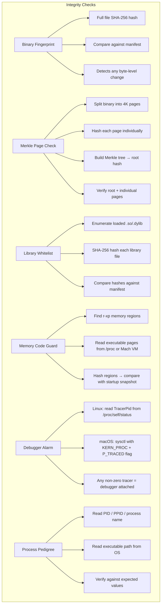

#### 1. Binary Fingerprint — Full File Integrity

**What it does:** Reads the entire executable file from disk and computes a SHA-256 hash. Compares the result against the hash stored in the manifest at generation time.

**What it detects:** Any modification to the binary file — patching, virus infection, corruption, or replacement. A single byte change produces a completely different hash.

**How it's implemented:**
```
File on disk → std::fs::read() → SHA-256::digest() → hex::encode()
                                                      ↓
                                           Compare with manifest.root_hash
```

**OS support:** Works on Linux, macOS, and Windows. Requires the file to be readable (standard for any running process's own binary). Works on ext4, XFS, Btrfs, APFS, NTFS, ZFS — any filesystem that supports reading files.

#### 2. Merkle Page Check — Page-Level Integrity

This is a two-phase process: **manifest generation** (at build/deploy time) and **runtime verification** (in the application).

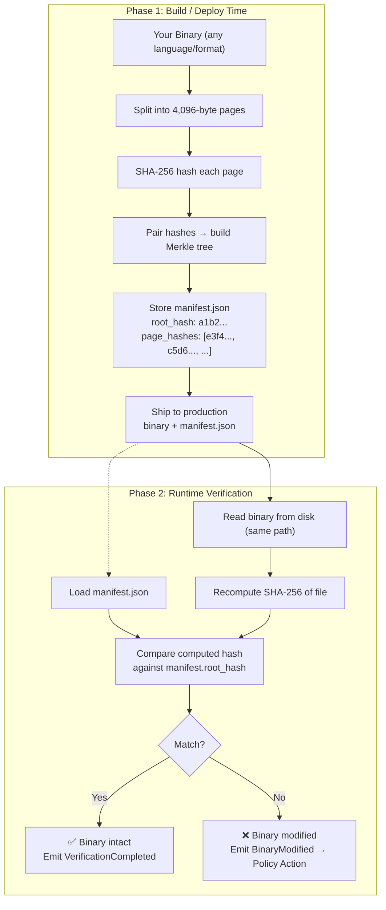

**What it does:** At build time, splits the binary into 4,096-byte pages, hashes each, builds a Merkle tree, and stores the root hash + all page hashes in `manifest.json`. At runtime, re-reads the file, recomputes the root hash, and compares it against the manifest value. If they match, the binary is unmodified. If they differ, something changed.

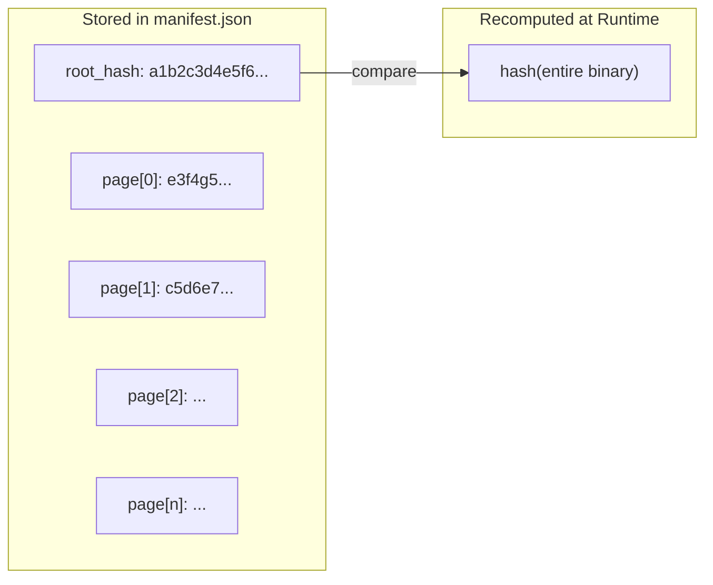

**Why page-level over whole-file?** If the binary integrity check fails, a full-file hash tells you only "something changed." The Merkle tree tells you **which 4K page** changed, enabling targeted forensic analysis.

**How it's implemented:**
```rust
// ─── BUILD TIME ───────────────────────────────────────────
let data = std::fs::read("myapp")?;
let tree = build_merkle_tree(&data);     // hash pages → build tree
let manifest = Manifest {
    root_hash:  hex::encode(tree.root.hash),
    entries:    page_hashes,              // one hash per 4K page
    file_size:  data.len(),
    version:    "1.0.0",
};
std::fs::write("myapp.manifest.json", serde_json::to_string(&manifest)?)?;

// ─── RUNTIME ──────────────────────────────────────────────
let data = std::fs::read("myapp")?;
let tree = build_merkle_tree(&data);
if hex::encode(tree.root.hash) != manifest.root_hash {
    // Binary was modified — which page?
    for (i, hash) in manifest.entries.iter().enumerate() {
        if hash != hex::encode(tree.page_hashes[i]) {
            log::error!("Page {} was modified!", i);
        }
    }
}
```

**Filesystem & OS concerns:**

| Environment | Does Merkle Check Work? | Why |
|---|---|---|
| **Standard Linux (ext4/XFS)** | ✅ Yes | Normal file read access |
| **SELinux (Enforcing)** | ✅ Yes | Process has read access to its own binary by default; SELinux labels don't block self-read |
| **AppArmor** | ✅ Yes | Same — reading own binary is standard |
| **Docker Container** | ✅ Yes | Container has full access to its own filesystem |
| **Read-only rootfs** | ✅ Yes | Reading from read-only mount is allowed |
| **macOS (APFS)** | ✅ Yes | Normal file read |
| **Windows (NTFS)** | ✅ Yes | Normal file read via std::fs |
| **memfd / memfile** | ❌ No | No on-disk file to read; file exists only in memory |
| **tmpfs / ramfs** | ⚠️ Partial | File is readable but transient; manifest must be generated per-deployment |
| **FUSE filesystem** | ✅ Depends | Works if FUSE allows read access; performance depends on FUSE implementation |
| **SquashFS (read-only)** | ✅ Yes | Works — files are readable |
| **NFS / network mount** | ✅ Yes | Works, but latency may increase verification time |
| **Packed binary (UPX)** | ✅ Yes | Hash the packed binary as-is; generate manifest after packing |

**Key point:** The Merkle page check uses standard file I/O (`std::fs::read` in Rust, which maps to `read()` / `pread()` system calls). It does **not** require any special kernel module, filesystem feature, or security policy exemption. If the process can read its own binary file (which every running process can), the Merkle check works.

#### 3. Library Whitelist — Loaded Library Verification

**What it does:** At startup and during runtime monitoring, enumerates all shared libraries loaded into the process, computes their SHA-256 hash, and compares against the manifest.

**What it detects:**
- Modified system libraries (libc, libssl, etc.)
- LD_PRELOAD / DYLD_INSERT_LIBRARIES injection
- Trojanized library substitutions
- Unexpected libraries loaded into the process

**How it's implemented:**
```
Linux:   parse /proc/self/maps for .so paths → hash each unique file
macOS:   _dyld_get_image_name() for each loaded image → hash each unique file
```

#### 4. Memory Code Guard — Runtime Code Integrity

**What it does:** At startup, takes a snapshot of all executable (non-writable) memory regions. During runtime verification, re-reads those regions and compares hashes.

**What it detects:**
- In-memory code patching (hotpatching, byte editing)
- Detour hooks (modifying function prologues)
- Code cave injection
- ROP gadget modification

**How it's implemented:**
```
Linux:   parse /proc/self/maps for r-xp regions → read via /proc/self/mem → hash
macOS:   mach_vm_region_recurse() for executable regions → mach_vm_read() → hash
```

#### 5. Debugger Alarm — Debugger Detection

**What it does:** Checks OS-level debugger flags at startup and periodically during runtime.

**What it detects:**
- gdb, lldb, strace, dtrace attached to the process
- Any ptrace-based debugger (Linux)
- Xcode debugger, LLDB (macOS)

**How it's implemented:**
```
Linux:   read /proc/self/status → parse TracerPid field → non-zero = debugger
macOS:   sysctl(KERN_PROC, KERN_PROC_PID, pid) → check P_TRACED flag in kinfo_proc
```

#### 6. Process Pedigree — Identity Verification

**What it does:** Reads the process's identity from the OS and exposes it for application-level checks.

**Data provided:**
- PID (process ID)
- PPID (parent process ID — detect if spawned by unexpected parent)
- Process name (should match expected)
- Executable path (should be in expected location)

**What it detects:**
- Process renaming (prctl PR_SET_NAME)
- Binary moved from original location
- Application running as a subprocess of an unexpected parent

#### 7. Policy Enforcement

Each detection event is routed through the policy engine, which maps it to an action:

| Event | Possible Actions |
|---|---|
| DebuggerDetected | `Terminate` / `Callback` / `Log` / `Ignore` |
| BinaryModified | `Terminate` / `Callback` / `Log` / `Ignore` |
| LibraryModified | `Terminate` / `Callback` / `Log` / `Ignore` |
| MemoryIntegrityFailed | `Terminate` / `Callback` / `Log` / `Ignore` |

Configured via TOML policy file:
```toml
DebuggerDetected = "Terminate"
BinaryModified = "Terminate"
LibraryModified = "Log"
MemoryModified = "Callback"
```

`Terminate` calls `exit(1)` immediately. `Callback` dispatches to your registered event handler. `Log` writes via the `log` crate. `Ignore` silently continues.

#### 8. Event Stream

All verification results and policy actions are delivered to registered callbacks:

```
Event Types:
  VerificationStarted          → "cycle beginning"
  VerificationCompleted        → "cycle done"
  DebuggerDetected             → "debugger found!"
  BinaryModified               → "binary changed!"
  LibraryModified              → "library mismatch!"
  MemoryIntegrityFailed        → "code page altered!"
  PolicyAction {event, action} → "BinaryModified → Terminate"
```

Events are dispatched synchronously from the verification thread. Callbacks are `Arc<dyn Fn(Event) + Send + Sync>`.

### Manifest Generation (CI/CD Step)

Manifests are generated once during CI/CD and shipped alongside the binary. This step is also language-agnostic:

```bash
# Generate manifest for any binary
# The binary can be C, Go, Rust, or anything else
./runtimeshield-manifest /path/to/myapp --output myapp.manifest.json
```

```json
{
  "root_hash": "a1b2c3d4e5f6...",
  "total_pages": 24576,
  "file_size": 100663296,
  "version": "1.0.0"
}
```

### Real-World Workflow

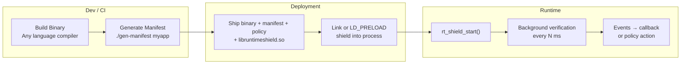

### Summary

| Question | Answer |
|---|---|
| Do I need Rust in my project? | **No.** RuntimeShield is written in Rust but consumed as a C library. Any language with C FFI works. |
| Do I need to modify my app's source? | **Not if using dlopen/LD_PRELOAD.** You can wrap an existing binary without touching its source. |
| Does it work with Go's static binaries? | **Yes.** Use `dlopen` at runtime or link the C archive. |
| Does it work with Python/.NET/Java? | **Yes.** Those runtimes can call C libraries. The native executable (Python interpreter, dotnet host, JVM) is what gets verified. |
| Does it work in Docker? | **Yes.** The `.so` and manifest are included in the image. |
| Does the binary format matter? | **No.** ELF (Linux), Mach-O (macOS), and PE (Windows) are all supported. The framework reads bytes, not structures. |

See [docs/22_Any_Language_Integration.md](docs/22_Any_Language_Integration.md) for code examples in Go, Python, C#, Node.js, and dlopen injection.

---

## Modules

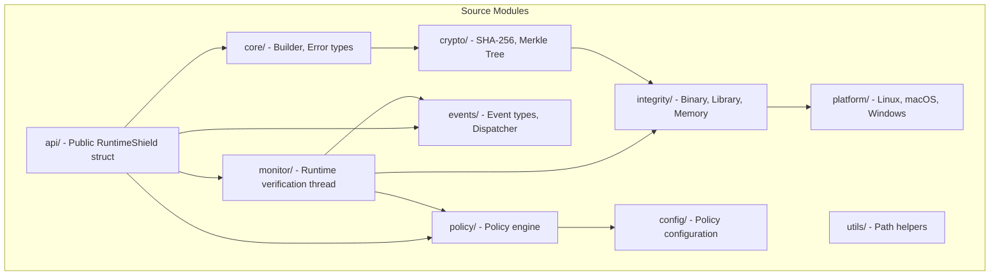

| Module | Description |
|---|---|
| `core/` | Builder pattern (`RuntimeShieldBuilder`), error types (`Error`, `Result`) |
| `config/` | TOML policy deserialization (`PolicyConfig`) |
| `crypto/` | SHA-256 hashing, Merkle tree construction and verification |
| `integrity/` | Binary (manifest-based), library (hash comparison), memory (region snapshot) |
| `platform/` | Trait definitions + Linux/macOS implementations, Windows stubs |
| `monitor/` | Background thread with configurable interval, dispatches events |
| `policy/` | Maps events to actions: `Terminate`, `Callback`, `Log`, `Ignore` |
| `events/` | Event enum, `EventDispatcher` with multi-callback support |
| `api/` | `RuntimeShield` struct: `start()`, `stop()`, `verify_now()`, `on_event()` |
| `utils/` | Manifest/path resolution helpers |

---

## Quick Start

### 1. Add dependency

```toml
[dependencies]
runtimeshield = { git = "https://github.com/swadhingoswami/RuntimeShield" }
```

### 2. Integrate

```rust
use runtimeshield::RuntimeShield;
use std::sync::Arc;

fn main() -> Result<(), Box<dyn std::error::Error>> {
    let mut shield = RuntimeShield::builder()
        .enable_startup_verification()
        .enable_runtime_monitor()
        .enable_binary_integrity()
        .enable_library_integrity()
        .enable_memory_integrity()
        .enable_anti_debug()
        .monitor_interval(5000)
        .on_event(Arc::new(|event| {
            println!("RuntimeShield event: {:?}", event);
        }))
        .build()?;

    shield.start()?;

    // On-demand check before sensitive operations
    let result = shield.verify_now()?;
    if !result.is_integrity_ok() {
        eprintln!("Integrity violation detected!");
    }

    // Keep alive
    loop {
        std::thread::sleep(std::time::Duration::from_secs(1));
    }
}
```

### 3. Generate manifest (CI/CD)

```rust
use runtimeshield::integrity::binary::BinaryIntegrity;

let integrity = BinaryIntegrity::new("/path/to/app");
let manifest = integrity.generate_manifest("1.0.0")?;
std::fs::write("app.manifest.json", serde_json::to_string_pretty(&manifest)?)?;
```

### 4. Configure policy

```toml
# runtime_policy.toml
DebuggerDetected = "Terminate"
BinaryModified = "Terminate"
LibraryModified = "Callback"
HashMismatch = "Log"
MemoryModified = "Callback"
```

---

## Platform Support

| Platform | Process Identity | Anti-Debug | Memory Integrity | Library Verification | Build Status |
|---|---|---|---|---|---|
| Linux | ✅ `/proc` | ✅ `TracerPid` | ✅ `/proc/self/mem` | ✅ `/proc/self/maps` | ✅ |
| macOS | ✅ `proc_name` / `_NSGetExecutablePath` | ✅ `sysctl P_TRACED` | ✅ `mach_vm_region` | ✅ `_dyld_get_image_name` | ✅ |
| Windows | 🚧 Stub | 🚧 Stub | 🚧 Stub | 🚧 Stub | ⏳ Planned |

---

## Event System

```rust
shield.on_event(Arc::new(|event: Event| {
    match event {
        Event::DebuggerDetected      => { /* alert */ }
        Event::BinaryModified        => { /* terminate */ }
        Event::LibraryModified       => { /* log & notify */ }
        Event::MemoryIntegrityFailed => { /* investigate */ }
        Event::VerificationStarted   => { /* update status */ }
        Event::VerificationCompleted => { /* update status */ }
        Event::PolicyAction { event, action } => { /* audit */ }
        _ => {}
    }
}));
```

Events are dispatched synchronously from the triggering thread. Callbacks must be `Send + Sync`.

---

## On-Demand Verification

```rust
let result = shield.verify_now()?;
println!("Binary: {}", if result.binary_ok { "✓" } else { "✗" });
println!("Library: {}", if result.library_ok { "✓" } else { "✗" });
println!("Memory: {}", if result.memory_ok { "✓" } else { "✗" });
println!("Debugger: {}", if result.debugger_detected { "DETECTED" } else { "not detected" });
```

---

## Design Principles

1. **Modular** — Enable only the protections you need. Every feature is an independent module.
2. **Builder Pattern** — All configuration flows through `RuntimeShieldBuilder`, preventing invalid states.
3. **Trait-Based Platform Abstraction** — Platform-specific code is behind traits; adding a new OS requires no core changes.
4. **No Global State** — RuntimeShield instances are independent. Multiple instances can coexist.
5. **No async runtime** — Uses `std::thread`; no tokio dependency.
6. **Honest About Limitations** — Clear documentation of what can and cannot be protected.

---

## Documentation

| Document | Description |
|---|---|
| [Introduction](docs/01_Introduction.md) | What RuntimeShield is and is not |
| [Threat Model](docs/02_Threat_Model.md) | In-scope and out-of-scope threats |
| [Architecture](docs/03_Architecture.md) | Module dependencies, threading, data flow |
| [Runtime Protection](docs/04_Runtime_Protection.md) | Detection vs prevention vs response |
| [Startup Verification](docs/05_Startup_Verification.md) | Pre-execution integrity checks |
| [Runtime Verification](docs/06_Runtime_Verification.md) | Background monitoring cycle |
| [On-Demand Verification](docs/07_On_Demand_Verification.md) | Application-triggered checks |
| [Binary Integrity](docs/08_Binary_Integrity.md) | Merkle tree manifest verification |
| [Merkle Tree](docs/09_Merkle_Tree.md) | Hash tree structure and properties |
| [Library Verification](docs/10_Library_Verification.md) | Shared library integrity |
| [Process Identity](docs/11_Process_Identity.md) | PID, parent, name verification |
| [Memory Integrity](docs/12_Memory_Integrity.md) | Code region hashing |
| [Anti-Debug](docs/13_Anti_Debug.md) | Debugger detection techniques |
| [Policy Engine](docs/14_Policy_Engine.md) | Event-to-action mapping |
| [Event System](docs/15_Event_System.md) | Callback registration and dispatch |
| [Cross-Platform Architecture](docs/16_Cross_Platform_Architecture.md) | Platform abstraction design |
| [API Guide](docs/17_API_Guide.md) | Full API reference |
| [Examples](docs/18_Examples.md) | Integration patterns |
| [Performance](docs/19_Performance.md) | Timing and resource usage |
| [Limitations](docs/20_Limitations.md) | What the framework cannot do |
| [Future Work](docs/21_Future_Work.md) | Planned features and roadmap |
| [Any Language Integration](docs/22_Any_Language_Integration.md) | Using RuntimeShield with C/C++/Go/Python/C#/Node.js |

---

## Future Scope

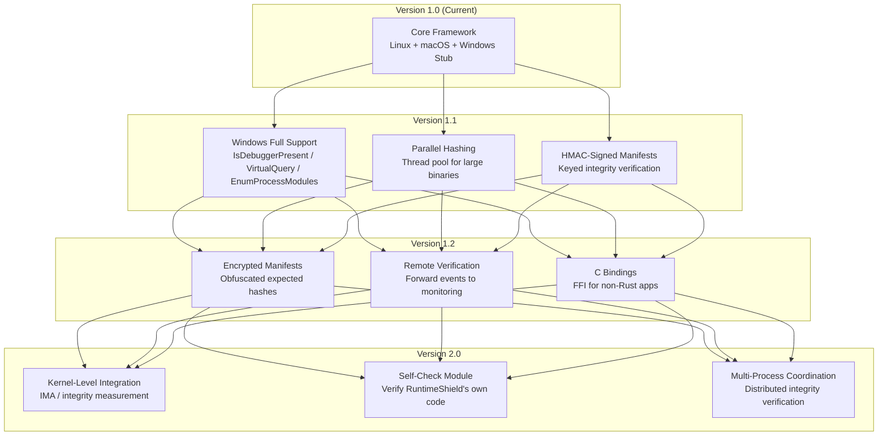

### Immediate Priorities

- **Windows platform**: Implement all three traits using `windows-sys` crate
- **Performance**: Parallel Merkle tree construction for large binaries
- **Manifest signing**: HMAC-based manifest authentication
- **C API**: `extern "C"` bindings for Python, Go, and C++ consumers

---

## Testing

```bash
cargo test        # 54 tests (unit + integration + platform)
cargo clippy      # Zero warnings
cargo build       # Stable Rust, no nightly features
```

---

## License

Licensed under either of [MIT](LICENSE-MIT) or [Apache-2.0](LICENSE-APACHE) at your option.
