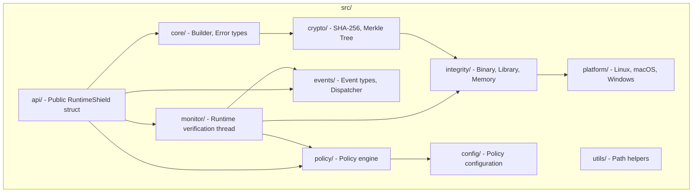
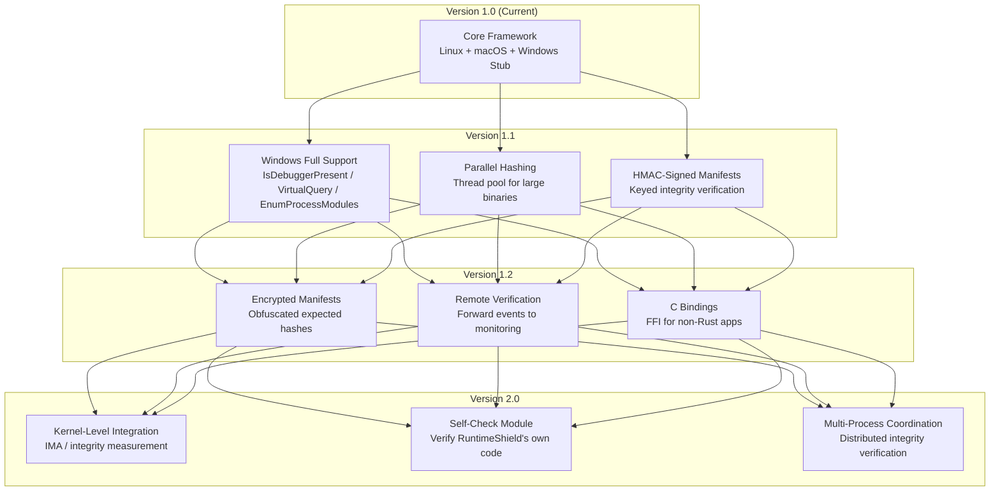

# RuntimeShield

**Cross-Platform Runtime Protection Framework for Native Applications**

[](https://github.com/swadhingoswami/RuntimeShield/actions/workflows/ci.yml)
[](https://rust-lang.org)
[](LICENSE)
-success)


---

RuntimeShield is a modular SDK that native applications embed to verify their own integrity, detect runtime tampering, and respond through configurable policies. It is **not** an antivirus, anti-cheat, or DRM system — it is an integrity verification framework designed for clean integration.

```rust
let mut shield = RuntimeShield::builder()
    .enable_startup_verification()
    .enable_runtime_monitor()
    .enable_binary_integrity()
    .enable_library_integrity()
    .enable_memory_integrity()
    .enable_anti_debug()
    .on_event(Arc::new(|event| { /* handle event */ }))
    .build()?;
shield.start()?;
```

---

## Architecture

```mermaid
graph TB
    subgraph "Application"
        APP[Your Application Code]
    end

    subgraph "RuntimeShield Public API"
        API[RuntimeShield<br/>builder() / start() / verify_now()]
        CB[Event Callbacks<br/>Arc&lt;dyn Fn(Event)&gt;]
    end

    subgraph "Core Services"
        BLD[Builder Pattern<br/>Configuration]
        POL[Policy Engine<br/>Terminate / Callback / Log / Ignore]
        MON[Runtime Monitor<br/>Background Verification Thread]
        EVT[Event Dispatcher<br/>Multi-callback Dispatch]
    end

    subgraph "Integrity Verification"
        BIN[Binary Integrity<br/>SHA-256 + Merkle Tree]
        LIB[Library Integrity<br/>Loaded Library Hashing]
        MEM[Memory Integrity<br/>Executable Code Regions]
        AD[Anti-Debug<br/>Debugger Detection]
        PID[Process Identity<br/>PID / PPID / Name / Path]
    end

    subgraph "Cryptography"
        HASH[SHA-256 Hashing]
        MKL[Merkle Tree<br/>Root Hash + Page Hashes]
    end

    subgraph "Platform Abstraction Layer"
        TRAITS[ProcessIdentity / DebuggerDetector / MemoryRegionReader]
        LINUX["Linux Implementation<br/>TracerPid / procfs / dl_iterate_phdr"]
        MACOS["macOS Implementation<br/>sysctl P_TRACED / Mach VM / dyld"]
        WINDOWS["Windows Stub<br/>Architecture Designed"]
    end

    APP --> API
    API --> BLD
    API --> CB
    API --> MON
    API --> POL
    API --> EVT

    MON --> BIN & LIB & MEM & AD

    BIN --> HASH
    BIN --> MKL
    LIB --> HASH
    MEM --> HASH
    AD --> TRAITS

    BIN & LIB & MEM & AD & PID --> TRAITS
    TRAITS --> LINUX & MACOS & WINDOWS
```

---

## How It Works

### Verification Pipeline

```mermaid
flowchart LR
    subgraph "Configure"
        A[Policy TOML] --> B[Policy Engine]
        C[Event Callbacks] --> D[Event Dispatcher]
    end

    subgraph "Startup"
        E[Anti-Debug Check] --> F[Binary Manifest Verify]
        F --> G[Library Enumeration]
        G --> H[Memory Region Snapshot]
    end

    subgraph "Runtime (Background Thread)"
        I[Every N ms] --> J{Verify Cycle}
        J --> K[Debugger?]
        J --> L[Binary Intact?]
        J --> M[Libraries Match?]
        J --> N[Memory Unchanged?]
        K & L & M & N --> O[Policy Engine]
        O --> P{Action}
        P -->|Terminate| Q[exit(1)]
        P -->|Callback| R[dispatch Event]
        P -->|Log| S[log::warn!]
        P -->|Ignore| T[continue]
    end

    subgraph "On-Demand"
        U[Application Calls verify_now()] --> V[Run All Checks]
        V --> W[Return VerificationResult]
    end
```

### Threading Model

```mermaid
graph LR
    subgraph "Main Thread"
        M1[Application Code]
        M2[start() / verify_now() / stop()]
    end

    subgraph "Background Thread"
        B1[Verification Loop]
        B2[Sleep interval_ms]
        B3[Execute Checks]
        B4[Dispatch Events]
    end

    M1 -->|start()| M2
    M2 -->|spawns| B1
    B1 --> B2 --> B3 --> B4 --> B2
    B4 -->|callback| M1
```

**Synchronization:** No shared mutable state. Verification modules are cloned at startup. Events use `Arc<dyn Fn(Event) + Send + Sync>`.

---

## Platform Implementation

### Linux
| Feature | Technique | Source |
|---|---|---|
| Process Identity | `/proc/self/status`, `/proc/self/exe` | `src/platform/linux/` |
| Debugger Detection | `TracerPid` in `/proc/self/status` | `debugger.rs` |
| Memory Regions | `/proc/self/maps` + `/proc/self/mem` | `memory.rs` |
| Library Enumeration | `/proc/self/maps` parsing (.so paths) | `integrity/library.rs` |

### macOS
| Feature | Technique | Source |
|---|---|---|
| Process Identity | `proc_name()`, `_NSGetExecutablePath()`, `getppid()` | `src/platform/macos/` |
| Debugger Detection | `sysctl` with `KERN_PROC` + `P_TRACED` flag | `debugger.rs` |
| Memory Regions | `mach_vm_region_recurse()` + `mach_vm_read()` | `memory.rs` |
| Library Enumeration | `_dyld_image_count()` + `_dyld_get_image_name()` | `integrity/library.rs` |

### Windows
Architecture designed, implementation deferred. Trait implementations in `src/platform/windows/` are stubs ready for:
- `IsDebuggerPresent()` / `NtQueryInformationProcess` for anti-debug
- `VirtualQueryEx` / `ReadProcessMemory` for memory integrity
- `EnumProcessModules` for library enumeration
- `GetModuleFileName` / `GetCurrentProcessId` for process identity

---

## Modules



| Module | Description |
|---|---|
| `core/` | Builder pattern (`RuntimeShieldBuilder`), error types (`Error`, `Result`) |
| `config/` | TOML policy deserialization (`PolicyConfig`) |
| `crypto/` | SHA-256 hashing, Merkle tree construction and verification |
| `integrity/` | Binary (manifest-based), library (hash comparison), memory (region snapshot) |
| `platform/` | Trait definitions + Linux/macOS implementations, Windows stubs |
| `monitor/` | Background thread with configurable interval, dispatches events |
| `policy/` | Maps events to actions: `Terminate`, `Callback`, `Log`, `Ignore` |
| `events/` | Event enum, `EventDispatcher` with multi-callback support |
| `api/` | `RuntimeShield` struct: `start()`, `stop()`, `verify_now()`, `on_event()` |
| `utils/` | Manifest/path resolution helpers |

---

## Quick Start

### 1. Add dependency

```toml
[dependencies]
runtimeshield = { git = "https://github.com/swadhingoswami/RuntimeShield" }
```

### 2. Integrate

```rust
use runtimeshield::RuntimeShield;
use std::sync::Arc;

fn main() -> Result<(), Box<dyn std::error::Error>> {
    let mut shield = RuntimeShield::builder()
        .enable_startup_verification()
        .enable_runtime_monitor()
        .enable_binary_integrity()
        .enable_library_integrity()
        .enable_memory_integrity()
        .enable_anti_debug()
        .monitor_interval(5000)
        .on_event(Arc::new(|event| {
            println!("RuntimeShield event: {:?}", event);
        }))
        .build()?;

    shield.start()?;

    // On-demand check before sensitive operations
    let result = shield.verify_now()?;
    if !result.is_integrity_ok() {
        eprintln!("Integrity violation detected!");
    }

    // Keep alive
    loop {
        std::thread::sleep(std::time::Duration::from_secs(1));
    }
}
```

### 3. Generate manifest (CI/CD)

```rust
use runtimeshield::integrity::binary::BinaryIntegrity;

let integrity = BinaryIntegrity::new("/path/to/app");
let manifest = integrity.generate_manifest("1.0.0")?;
std::fs::write("app.manifest.json", serde_json::to_string_pretty(&manifest)?)?;
```

### 4. Configure policy

```toml
# runtime_policy.toml
DebuggerDetected = "Terminate"
BinaryModified = "Terminate"
LibraryModified = "Callback"
HashMismatch = "Log"
MemoryModified = "Callback"
```

---

## Platform Support

| Platform | Process Identity | Anti-Debug | Memory Integrity | Library Verification | Build Status |
|---|---|---|---|---|---|
| Linux | ✅ `/proc` | ✅ `TracerPid` | ✅ `/proc/self/mem` | ✅ `/proc/self/maps` | ✅ |
| macOS | ✅ `proc_name` / `_NSGetExecutablePath` | ✅ `sysctl P_TRACED` | ✅ `mach_vm_region` | ✅ `_dyld_get_image_name` | ✅ |
| Windows | 🚧 Stub | 🚧 Stub | 🚧 Stub | 🚧 Stub | ⏳ Planned |

---

## Event System

```rust
shield.on_event(Arc::new(|event: Event| {
    match event {
        Event::DebuggerDetected      => { /* alert */ }
        Event::BinaryModified        => { /* terminate */ }
        Event::LibraryModified       => { /* log & notify */ }
        Event::MemoryIntegrityFailed => { /* investigate */ }
        Event::VerificationStarted   => { /* update status */ }
        Event::VerificationCompleted => { /* update status */ }
        Event::PolicyAction { event, action } => { /* audit */ }
        _ => {}
    }
}));
```

Events are dispatched synchronously from the triggering thread. Callbacks must be `Send + Sync`.

---

## On-Demand Verification

```rust
let result = shield.verify_now()?;
println!("Binary: {}", if result.binary_ok { "✓" } else { "✗" });
println!("Library: {}", if result.library_ok { "✓" } else { "✗" });
println!("Memory: {}", if result.memory_ok { "✓" } else { "✗" });
println!("Debugger: {}", if result.debugger_detected { "DETECTED" } else { "not detected" });
```

---

## Design Principles

1. **Modular** — Enable only the protections you need. Every feature is an independent module.
2. **Builder Pattern** — All configuration flows through `RuntimeShieldBuilder`, preventing invalid states.
3. **Trait-Based Platform Abstraction** — Platform-specific code is behind traits; adding a new OS requires no core changes.
4. **No Global State** — RuntimeShield instances are independent. Multiple instances can coexist.
5. **No async runtime** — Uses `std::thread`; no tokio dependency.
6. **Honest About Limitations** — Clear documentation of what can and cannot be protected.

---

## Documentation

| Document | Description |
|---|---|
| [Introduction](docs/01_Introduction.md) | What RuntimeShield is and is not |
| [Threat Model](docs/02_Threat_Model.md) | In-scope and out-of-scope threats |
| [Architecture](docs/03_Architecture.md) | Module dependencies, threading, data flow |
| [Runtime Protection](docs/04_Runtime_Protection.md) | Detection vs prevention vs response |
| [Startup Verification](docs/05_Startup_Verification.md) | Pre-execution integrity checks |
| [Runtime Verification](docs/06_Runtime_Verification.md) | Background monitoring cycle |
| [On-Demand Verification](docs/07_On_Demand_Verification.md) | Application-triggered checks |
| [Binary Integrity](docs/08_Binary_Integrity.md) | Merkle tree manifest verification |
| [Merkle Tree](docs/09_Merkle_Tree.md) | Hash tree structure and properties |
| [Library Verification](docs/10_Library_Verification.md) | Shared library integrity |
| [Process Identity](docs/11_Process_Identity.md) | PID, parent, name verification |
| [Memory Integrity](docs/12_Memory_Integrity.md) | Code region hashing |
| [Anti-Debug](docs/13_Anti_Debug.md) | Debugger detection techniques |
| [Policy Engine](docs/14_Policy_Engine.md) | Event-to-action mapping |
| [Event System](docs/15_Event_System.md) | Callback registration and dispatch |
| [Cross-Platform Architecture](docs/16_Cross_Platform_Architecture.md) | Platform abstraction design |
| [API Guide](docs/17_API_Guide.md) | Full API reference |
| [Examples](docs/18_Examples.md) | Integration patterns |
| [Performance](docs/19_Performance.md) | Timing and resource usage |
| [Limitations](docs/20_Limitations.md) | What the framework cannot do |
| [Future Work](docs/21_Future_Work.md) | Planned features and roadmap |

---

## Future Scope



### Immediate Priorities

- **Windows platform**: Implement all three traits using `windows-sys` crate
- **Performance**: Parallel Merkle tree construction for large binaries
- **Manifest signing**: HMAC-based manifest authentication
- **C API**: `extern "C"` bindings for Python, Go, and C++ consumers

---

## Testing

```bash
cargo test        # 54 tests (unit + integration + platform)
cargo clippy      # Zero warnings
cargo build       # Stable Rust, no nightly features
```

---

## License

Licensed under either of [MIT](LICENSE-MIT) or [Apache-2.0](LICENSE-APACHE) at your option.
