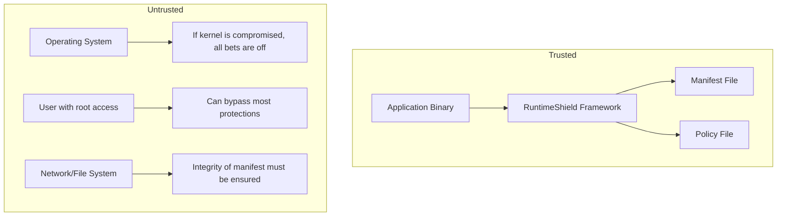
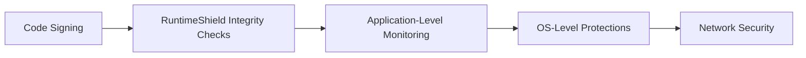

# Threat Model

## Overview

This document defines the threat model for RuntimeShield. Understanding what the framework protects against — and what it does not — is essential for making informed integration decisions.

## Threat Landscape

RuntimeShield addresses a specific subset of runtime tampering attacks. These are attacks that modify the application's code or environment after the application has been built and distributed.

```
                     Attack Surface
┌─────────────────────────────────────────────────────────┐
│                     Application Binary                    │
│  ┌─────────────────────────────────────────────────────┐ │
│  │  Disk Modification    │   Library Substitution      │ │
│  │  (binary patching)    │   (LD_PRELOAD, dylib hijack)│ │
│  └─────────────────────────────────────────────────────┘ │
│  ┌─────────────────────────────────────────────────────┐ │
│  │  Memory Modification  │   Debugger Attachment       │ │
│  │  (runtime code patching)  (gdb, lldb, Hopper, etc) │ │
│  └─────────────────────────────────────────────────────┘ │
│  ┌─────────────────────────────────────────────────────┐ │
│  │  Process Manipulation    │   Environment Tampering   │ │
│  │  (ptrace, injection)    │   (LD_PRELOAD, DYLD_*)    │ │
│  └─────────────────────────────────────────────────────┘ │
└─────────────────────────────────────────────────────────┘
```

## In-Scope Threats

### 1. Binary File Modification

An attacker modifies the application executable on disk to alter behavior, remove checks, or inject code.

**Detection**: Merkle tree-based integrity verification against a signed manifest.

**Limitations**: Detection occurs at startup or during periodic checks. If the manifest itself is compromised, verification cannot be trusted.

### 2. Shared Library Substitution

An attacker replaces a legitimate shared library with a modified version or uses LD_PRELOAD/DYLD_INSERT_LIBRARIES to inject code.

**Detection**: Hashing of loaded libraries and comparison against a manifest.

**Limitations**: Cannot distinguish between legitimate updates and malicious modifications without an updated manifest.

### 3. Debugger Attachment

An attacker attaches a debugger to inspect or modify runtime behavior.

**Detection**: Platform-specific techniques (TracerPid on Linux, sysctl on macOS, API checks on Windows).

**Limitations**: Debugger detection can be bypassed by experienced attackers. It is a deterrent, not a guarantee.

### 4. Runtime Code Modification

An attacker modifies executable code sections in memory during execution.

**Detection**: Periodic hashing of executable memory regions.

**Limitations**: Only protects regions that were snapshotted at startup. Self-modifying code and JIT regions require explicit configuration.

## Out-of-Scope Threats

RuntimeShield explicitly does **not** protect against:

| Threat | Reason |
|---|---|
| Kernel-level tampering | Requires ring 0 access; RuntimeShield operates in user space |
| Hardware attacks (JTAG, bus sniffing) | Physical access attacks outside scope |
| Source code access | If attacker has source, they can rebuild without protections |
| Network-based attacks | Out of scope (use TLS, certificate pinning) |
| Side-channel attacks | Requires specialized hardware or statistical analysis |
| Social engineering | Cannot protect against users who willingly bypass protections |
| Zero-day exploits | Unknown vulnerabilities cannot be specifically detected |
| Memory dumping (core dumps) | RuntimeShield does not prevent process dumping |
| Code obfuscation | RuntimeShield verifies integrity, it does not obfuscate |

## Trust Model

RuntimeShield operates within these trust assumptions:



### Trust Anchor

The trust anchor for RuntimeShield is the application binary itself as shipped by the developer. If the binary is tampered with before first execution, RuntimeShield cannot detect this because there's no "known good" baseline.

### Manifest Trust

The integrity manifest is assumed to be:
1. Generated from a known-good build
2. Distributed securely (signed, over HTTPS, embedded in the binary)
3. Verified before use (the application should verify the manifest signature if cryptographic signing is used)

## Defense-in-Depth

RuntimeShield is one layer in a defense-in-depth strategy:



Each layer addresses different threats. RuntimeShield focuses on runtime integrity verification and tampering detection.

## Risk Assessment

| Attack Vector | Difficulty | Impact | Detection Probability |
|---|---|---|---|
| Binary patching | Low | High | High |
| Library substitution | Low | High | Medium-High |
| Debugger attachment | Low | Medium | Medium |
| Runtime memory patching | Medium | High | Medium |
| Kernel rootkit | Very High | Critical | None (user space) |
| Hardware attack | Very High | Critical | None |
| Source access | N/A | N/A | Not applicable |

## Responsible Disclosure

This threat model is not exhaustive. If you identify a novel attack vector or bypass technique, please open an issue or security advisory on the GitHub repository.
