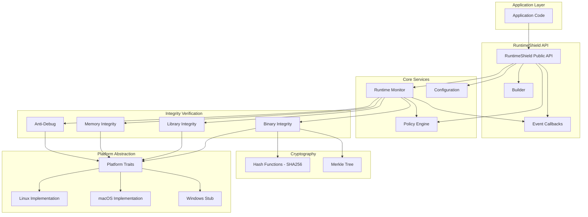
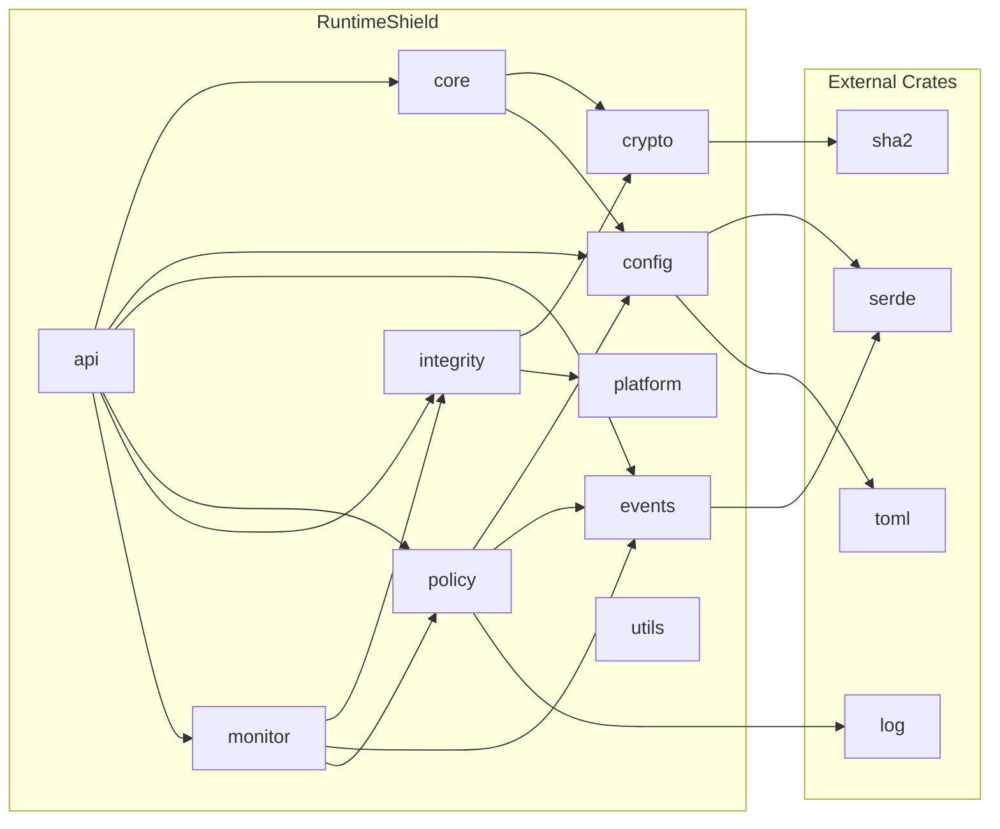
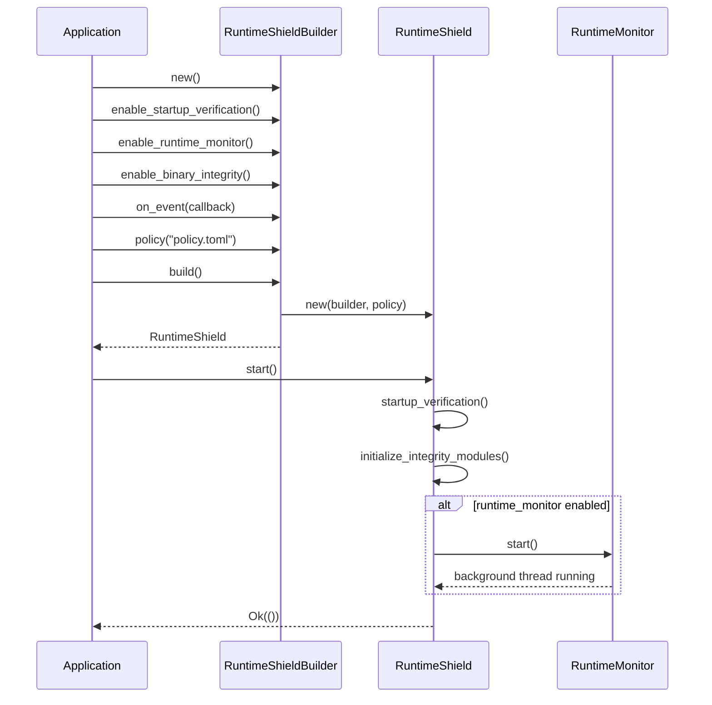

# Architecture

## High-Level Architecture

RuntimeShield follows a layered architecture with clear separation of concerns.



## Module Dependencies



## Builder Pattern



## Threading Model

```mermaid
graph LR
    subgraph "Main Application Thread"
        APP[Application]
        API[RuntimeShield API]
    end
    
    subgraph "Background Verification Thread"
        MON[RuntimeMonitor]
        VERIFY{Verification Loop}
        EVTDISP[Event Dispatch]
    end
    
    APP -->|start()| API
    API -->|spawns| MON
    MON -->|every interval| VERIFY
    VERIFY -->|events| EVTDISP
    EVTDISP -->|callbacks| APP
    
    style MON fill:#f9f,stroke:#333,stroke-width:2px
```

The threading model is intentionally simple:

- **Main thread**: Application code and RuntimeShield API calls
- **Background thread**: Runtime verification loop (if enabled)
- **Synchronization**: Events are dispatched via `Arc<dyn Fn(Event) + Send + Sync>` callbacks. The policy engine is stateless for thread safety.

## Data Flow

```mermaid
flowchart LR
    A[Builder Configuration] --> B[RuntimeShield Instance]
    B --> C{start() called?}
    C -->|Yes| D[Startup Verification]
    C -->|No| E[Idle]
    D --> F[Initialize Modules]
    F --> G{Background Monitor?}
    G -->|Yes| H[Spawn Verification Thread]
    G -->|No| I[Ready for On-Demand]
    H --> J[Verification Loop]
    J --> K{Integrity OK?}
    K -->|Yes| J
    K -->|No| L[Policy Engine]
    L --> M{Action}
    M -->|Terminate| N[exit process]
    M -->|Callback| O[dispatch event]
    M -->|Log| P[log warning]
    M -->|Ignore| Q[do nothing]
```

## Key Design Decisions

1. **No async runtime** — Uses standard threads instead of tokio to minimize dependencies and complexity.

2. **Stateless policy engine** — The policy engine has no internal state, making it safe to share across threads.

3. **Event-based communication** — Verification results are communicated through events and callbacks, not through return values or shared state.

4. **Builder pattern** — All configuration flows through the builder, making the API discoverable and preventing invalid states.

5. **Trait-based platform abstraction** — Platform-specific code is behind traits, allowing clean separation and testability.

6. **No global state** — RuntimeShield instances are independent. Multiple instances can exist in the same process.
