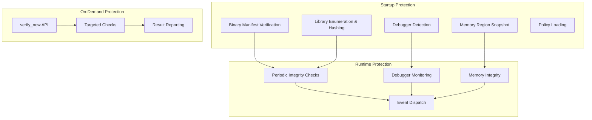
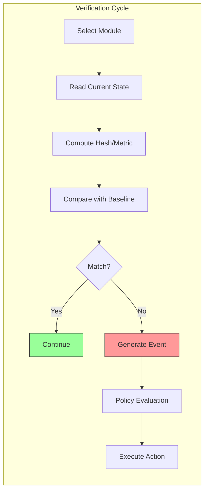

# Runtime Protection

## Overview

Runtime protection encompasses the detection, response, and reporting mechanisms that operate during application execution. RuntimeShield provides three modes of protection that work together.

## Protection Modes



## Detection vs Prevention vs Response

RuntimeShield implements three distinct security concepts:

### Detection

The ability to identify that a tampering attempt has occurred. Examples:

- Binary hash mismatch against the manifest
- Library hash mismatch against the manifest  
- Debugger presence detected via /proc/sysctl
- Memory page hash mismatch

### Prevention

The ability to stop a tampering attempt before it succeeds. RuntimeShield has limited prevention capabilities:

- **Startup verification** runs before the application performs sensitive operations
- **Policy actions** like `Terminate` can stop execution when violations are detected

RuntimeShield does **not** implement:
- Memory page protection (mprotect with NX)
- Seccomp filters
- File system monitoring
- Process isolation

### Response

The configured reaction to a detection event:

| Response | Description |
|---|---|
| `Terminate` | Call `std::process::exit(1)` immediately |
| `Callback` | Dispatch an event to registered callbacks; let the application decide |
| `Log` | Log a warning via the `log` crate |
| `Ignore` | Take no action (event is still dispatched) |

## Verification Pipeline



## Configuration Examples

### Minimal Configuration

```rust
use runtimeshield::RuntimeShield;

let mut shield = RuntimeShield::builder()
    .enable_anti_debug()
    .enable_binary_integrity()
    .build()?;
```

### Full Protection

```rust
use runtimeshield::RuntimeShield;

let mut shield = RuntimeShield::builder()
    .enable_startup_verification()
    .enable_runtime_monitor()
    .enable_binary_integrity()
    .enable_library_integrity()
    .enable_process_identity()
    .enable_memory_integrity()
    .enable_anti_debug()
    .monitor_interval(5000)
    .on_event(Arc::new(|event| {
        match event {
            Event::DebuggerDetected => { /* alert */ }
            Event::BinaryModified => { /* respond */ }
            _ => {}
        }
    }))
    .build()?;
```

## Performance Impact

Runtime protection incurs costs:

- **Startup**: Manifest loading, binary hashing, library enumeration (100-500ms depending on binary size)
- **Runtime**: Periodic verification (configurable interval, typically 10-50ms per cycle)
- **Memory**: Manifest in memory (~1MB for 100MB binary with 4K pages)

See [Performance](19_Performance.md) for detailed measurements.

## Best Practices

1. **Enable only what you need** — Every module adds overhead. Enable only the protections relevant to your threat model.

2. **Use appropriate intervals** — Runtime verification every 100ms is aggressive. Every 30-60 seconds is typical for most applications.

3. **Handle events gracefully** — Register a callback that logs events and, if appropriate, alerts the user or triggers a restart.

4. **Generate manifests as part of CI/CD** — Manifests should be generated during the build process, not manually.

5. **Protect the manifest** — The manifest should be distributed securely. Consider embedding it in the binary or signing it with a code signing certificate.

6. **Test with your workflow** — Verify that RuntimeShield's protection works with your development and deployment workflows before production use.
