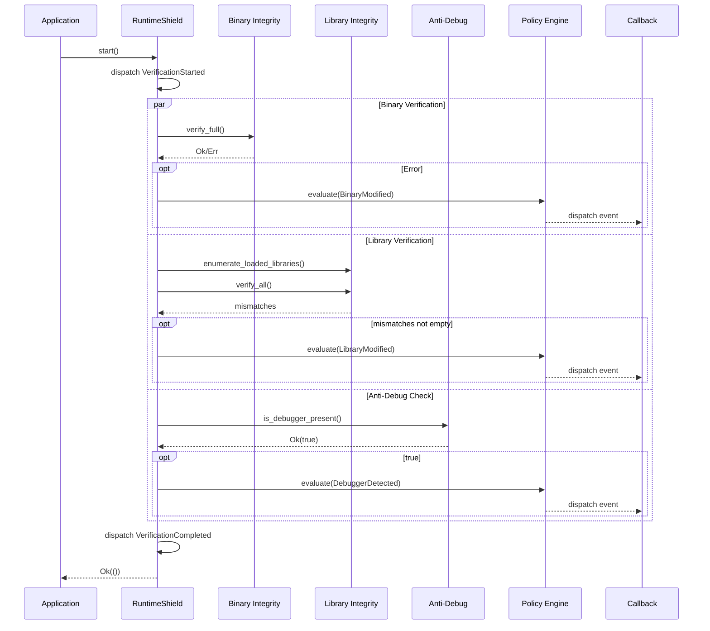

# Startup Verification

## Overview

Startup verification runs before the application enters its normal execution flow. It establishes a baseline of trust by verifying the application's critical components before any sensitive operations begin.

## Flow



## What Gets Verified at Startup

### 1. Executable Integrity

The application binary is read from disk and its Merkle tree root hash is compared against the manifest. This detects:

- Binary patching (cracked executables)
- Virus-infected binaries
- Accidental corruption
- Unauthorized modifications

### 2. Loaded Libraries

Initial set of loaded shared libraries is enumerated and their hashes are recorded. This establishes a baseline for runtime monitoring.

### 3. Debugger Detection

A check for attached debuggers is performed. If a debugger is detected during startup, the configured policy action is taken immediately.

### 4. Policy Loading

The runtime policy file is loaded and validated. If the policy file is missing or malformed, startup can fail depending on configuration.

## Startup Sequence

```mermaid
graph TB
    A[Application calls start()] --> B[Policy Engine Initialization]
    B --> C[Register Event Callbacks]
    C --> D[Anti-Debug Check]
    D --> E{Debugger?}
    E -->|Yes| F[Policy Action]
    E -->|No| G[Binary Integrity Check]
    F --> H{Terminate?}
    H -->|Yes| I[exit(1)]
    H -->|No| G
    G --> J{Binary Modified?}
    J -->|Yes| K[Policy Action]
    J -->|No| L[Library Enumeration]
    K --> M{Terminate?}
    M -->|Yes| I
    M -->|No| L
    L --> N[Memory Region Snapshot]
    N --> O[Start Runtime Monitor]
    O --> P[Return Ok]
    
    style I fill:#f99,stroke:#333
    style P fill:#9f9,stroke:#333
```

## Configuration

Startup verification is enabled with:

```rust
let mut shield = RuntimeShield::builder()
    .enable_startup_verification()
    .build()?;
```

Startup verification is automatically enabled when `enable_binary_integrity()` or `enable_anti_debug()` is set, even without explicitly calling `enable_startup_verification()`.

## Partial Failure Handling

Startup verification can produce partial failures. For example:

- Binary integrity OK, but library enumeration failed
- Anti-debug check returned an error (e.g., /proc not available)

The policy engine handles each event independently. A failure in one verification does not prevent others from running.

## Manifest Loading

Manifests are loaded from the path specified in the builder:

```rust
let mut shield = RuntimeShield::builder()
    .enable_binary_integrity()
    .manifest("app.manifest.json")
    .build()?;
```

If no manifest path is specified, binary integrity checks will still work against the executable's hash (SHA-256), but page-level Merkle tree verification will not be available.

## Security Considerations

1. **Startup verification can be bypassed** if an attacker controls the environment before the application starts (e.g., LD_PRELOAD injected library).

2. **Manifest integrity is critical** — If the manifest is replaced along with the binary, verification is meaningless. Sign the manifest or embed it.

3. **Startup time increases** — Reading and hashing a large binary takes time. For a 100MB binary, expect 100-500ms of startup delay.

4. **Filesystem must be available** — The binary must be readable from disk. Containerized environments with read-only filesystems need special handling.

## Tradeoffs

| Approach | Pros | Cons |
|---|---|---|
| Hash entire binary | Simple, fast to verify | Cannot detect which page was modified |
| Merkle tree per page | Page-level granularity | More complex, larger manifest |
| Hash selected regions | Fast startup | Limited coverage |
