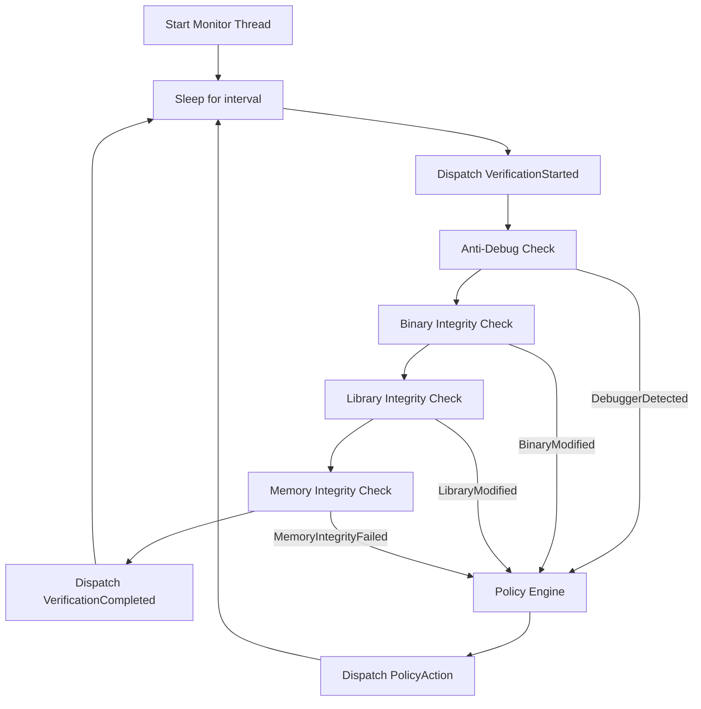
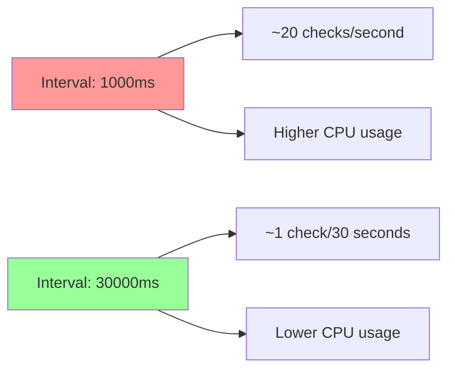

# Runtime Verification

## Overview

Runtime verification runs continuously in a background thread, periodically checking the application's integrity. It detects tampering that occurs after the application has started.

## Verification Loop



## Default Configuration

| Parameter | Default | Description |
|---|---|---|
| `monitor_interval` | 5000ms | Time between verification cycles |
| `binary_integrity` | Disabled | Check binary on disk |
| `library_integrity` | Disabled | Check loaded libraries |
| `memory_integrity` | Disabled | Check code memory regions |
| `anti_debug` | Disabled | Check for debugger |

## Configuration

```rust
let mut shield = RuntimeShield::builder()
    .enable_runtime_monitor()
    .enable_binary_integrity()
    .enable_library_integrity()
    .enable_memory_integrity()
    .enable_anti_debug()
    .monitor_interval(10000)  // every 10 seconds
    .build()?;
```

## What Gets Verified at Runtime

### Binary on Disk

The monitor re-reads the executable from disk and verifies its Merkle tree root hash. This catches modifications made after startup, such as:

- Runtime binary patching (e.g., from a packer unpacking)
- Filesystem-level tampering
- Mounted overlay filesystem changes

### Loaded Libraries

Libraries that were loaded at startup are re-checked. Newly loaded libraries are also checked if the manifest contains entries for them.

### Memory Regions

Executable code sections in memory are hashed and compared against the startup snapshot. This catches:

- In-memory code patching
- Runtime hook installation
- Code cave injection

### Debugger Presence

The debugger check runs every cycle, not just during startup. This catches debuggers attached after startup.

## Performance Considerations



### Recommendations

| Use Case | Recommended Interval |
|---|---|
| High-security, low-latency tolerant | 1000-5000ms |
| General protection | 5000-30000ms |
| Low overhead desired | 30000-60000ms |
| Very large binaries (>500MB) | 60000ms+ |

## Thread Safety

The runtime monitor runs in a separate thread. Verification modules are cloned from the main thread at startup:

```
Main Thread                     Monitor Thread
    |                               |
    |--- create BinaryIntegrity --->|  (cloned)
    |--- create LibraryIntegrity -->|  (cloned)
    |--- create MemoryIntegrity --->|  (cloned)
    |--- start() ------------------>|
    |                               |=== loop ===
    |                               |  verify
    |<-- event callbacks ----------|
```

The monitor thread dispatches events through `Arc<dyn Fn(Event) + Send + Sync>` callbacks, which must be `Send + Sync`.

## Stopping the Monitor

The monitor can be stopped explicitly:

```rust
shield.stop();
```

Or it stops automatically when the `RuntimeShield` instance is dropped.

## Error Handling

If a verification check fails (e.g., I/O error reading /proc), the monitor logs the error and dispatches an `Event::Error` but continues running. A single failed check does not stop the verification loop.
