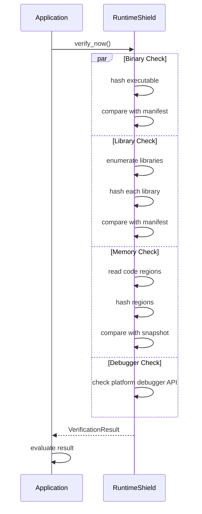

# On-Demand Verification

## Overview

On-demand verification allows the application to trigger integrity checks at any time. This is useful before sensitive operations, after dynamic code loading, or on specific user actions.

## API

```rust
pub fn verify_now(&self) -> Result<VerificationResult>
```

The method returns a `VerificationResult` with detailed status for each module:

```rust
pub struct VerificationResult {
    pub binary_ok: bool,
    pub library_ok: bool,
    pub memory_ok: bool,
    pub debugger_detected: bool,
    pub errors: Vec<String>,
}
```

## Usage Examples

### Before Sensitive Operations

```rust
fn perform_payment() -> Result<()> {
    let result = shield.verify_now()?;
    if !result.is_integrity_ok() {
        return Err("Integrity check failed before payment".into());
    }
    // Process payment
    Ok(())
}
```

### Periodic Health Check

```rust
fn health_check(shield: &RuntimeShield) {
    match shield.verify_now() {
        Ok(result) => {
            if result.debugger_detected {
                alert_security_team();
            }
            if !result.is_integrity_ok() {
                log_error(&result.errors);
            }
        }
        Err(e) => {
            log_error(&[format!("Verification failed: {}", e)]);
        }
    }
}
```

### Before Loading Dynamic Code

```rust
fn load_plugin(path: &Path) -> Result<()> {
    // Verify integrity before loading dynamic code
    let result = shield.verify_now()?;
    if !result.is_integrity_ok() {
        return Err("Environment integrity compromised".into());
    }
    
    unsafe {
        let lib = libloading::Library::new(path)?;
        // Use the library
    }
    Ok(())
}
```

## Flow



## When to Use On-Demand Verification

| Scenario | Recommended |
|---|---|
| Before cryptographic operations | ✅ Yes |
| Before network authentication | ✅ Yes |
| After loading plugins | ✅ Yes |
| On user-triggered action | ✅ Yes |
| As replacement for runtime monitor | ✅ Yes (but less coverage) |
| Every function call | ❌ No (too slow) |

## Performance

On-demand verification runs immediately in the calling thread. It blocks until all checks complete.

Typical timing:

| Binary Size | Verification Time |
|---|---|
| 10 MB | 10-30ms |
| 100 MB | 50-200ms |
| 500 MB | 200-800ms |

## Comparison with Runtime Monitor

| Aspect | On-Demand | Runtime Monitor |
|---|---|---|
| Timing | Application controlled | Periodic background |
| Thread | Calling thread | Background thread |
| Overhead | Sporadic | Continuous |
| Latency | Blocking | Non-blocking |
| Coverage | Point-in-time | Continuous |
| Use case | Before sensitive ops | General monitoring |
