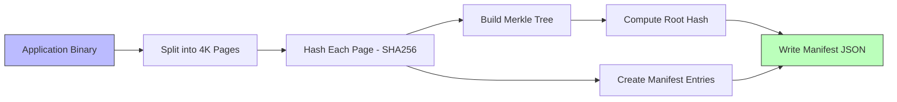

# Binary Integrity

## Overview

Binary integrity verification detects modifications to the application executable on disk. RuntimeShield implements a Merkle tree-based integrity verification system inspired by Linux fs-verity, but entirely in user space for cross-platform portability.

## Comparison with Linux fs-verity

### Linux fs-verity

Linux fs-verity is a kernel feature that provides read-only file integrity verification using Merkle trees. It:

- Operates in the kernel's VFS layer
- Verifies every page access transparently
- Immutable once enabled (requires `FS_IOC_ENABLE_VERITY`)
- Only available on Linux (since kernel 5.4)
- Requires root/privileged access to enable

### RuntimeShield User-Space Approach

RuntimeShield's binary integrity:

- Operates entirely in user space
- Verifies on-demand (startup, periodic, or manual)
- Works on Linux, macOS, and Windows
- Does not require special privileges
- Can be integrated into any Rust application
- Provides configurable verification frequency

### Tradeoffs

| Aspect | fs-verity | RuntimeShield |
|---|---|---|
| Verification timing | On every page access | On-demand configurable |
| OS support | Linux only | Linux, macOS, Windows |
| Privilege required | Root to enable | None |
| Kernel dependency | Yes | No |
| Performance | Negligible per access | Batch verification |
| Tamper resistance | Kernel enforced | User space |
| Granularity | Page-level | Page-level |

## Manifest Generation



### Manifest Format

```json
{
  "root_hash": "a1b2c3d4...",
  "entries": [
    {
      "page_index": 0,
      "page_hash": "e5f6a7b8...",
      "offset": 0,
      "size": 4096
    },
    {
      "page_index": 1,
      "page_hash": "c9d0e1f2...",
      "offset": 4096,
      "size": 4096
    }
  ],
  "total_pages": 128,
  "file_size": 524288,
  "version": "1.0.0",
  "timestamp": "1700000000"
}
```

## Verification Pipeline

```mermaid
flowchart TB
    subgraph "Verification"
        A[Read Binary from Disk] --> B[Split into Pages]
        B --> C[Hash Each Page]
        C --> D[Build Merkle Tree]
        D --> E[Get Root Hash]
        E --> F{root_hash == manifest.root_hash?}
        F -->|Yes| G[PASS - Binary Intact]
        F -->|No| H[FAIL - Binary Modified]
    end
    
    subgraph "Page Verification"
        I[Select Page Index] --> J[Read Page Data]
        J --> K[Hash Page]
        K --> L{hash == manifest.entries[i].page_hash?}
        L -->|Yes| M[Page Intact]
        L -->|No| N[Page Modified]
    end
    
    style G fill:#9f9,stroke:#333
    style H fill:#f99,stroke:#333
    style M fill:#9f9,stroke:#333
    style N fill:#f99,stroke:#333
```

## Implementation

```rust
// Generate manifest for the current binary
let integrity = BinaryIntegrity::new(exe_path);
let manifest = integrity.generate_manifest("1.0.0")?;

// Save manifest
let json = serde_json::to_string_pretty(&manifest)?;
std::fs::write("app.manifest.json", json)?;

// Load and verify
let mut integrity = BinaryIntegrity::new(exe_path);
integrity.load_manifest_from_path(Path::new("app.manifest.json"))?;
integrity.verify_full()?;  // Verify entire binary
integrity.verify_page(42)?; // Verify specific page
```

## Security Considerations

### What Binary Integrity Detects

- File corruption
- Binary patching / cracking
- Virus infection that modifies the executable
- Unauthorized binary replacement

### What Binary Integrity Does NOT Detect

- In-memory code modification (use memory integrity)
- Tampering before the first integrity check
- Modifications to files that don't have manifest entries
- Kernel-level file system redirection

### Trust Model

Binary integrity verification relies on:

1. **The manifest being authentic** — If both binary and manifest are replaced, verification is meaningless. Protect the manifest through code signing or embedding.

2. **The application binary being the first code to run** — If an attacker controls execution before RuntimeShield starts, they can bypass verification.

3. **Filesystem integrity** — RuntimeShield reads the binary through normal filesystem operations. A kernel rootkit could present a clean version for verification and a modified version for execution.

## Best Practices

1. **Generate manifests during CI/CD** — Include manifest generation in your build pipeline, not manually.

2. **Embed or sign manifests** — The manifest should be signed or embedded in the binary to prevent tampering.

3. **Verify at strategic points** — Verification at startup and before sensitive operations provides good coverage.

4. **Page-level vs full verification** — Use full verification at startup and page-level verification for targeted checks.

5. **Handle verification failures gracefully** — Log the event, alert operators, and determine the appropriate response based on your security policy.
