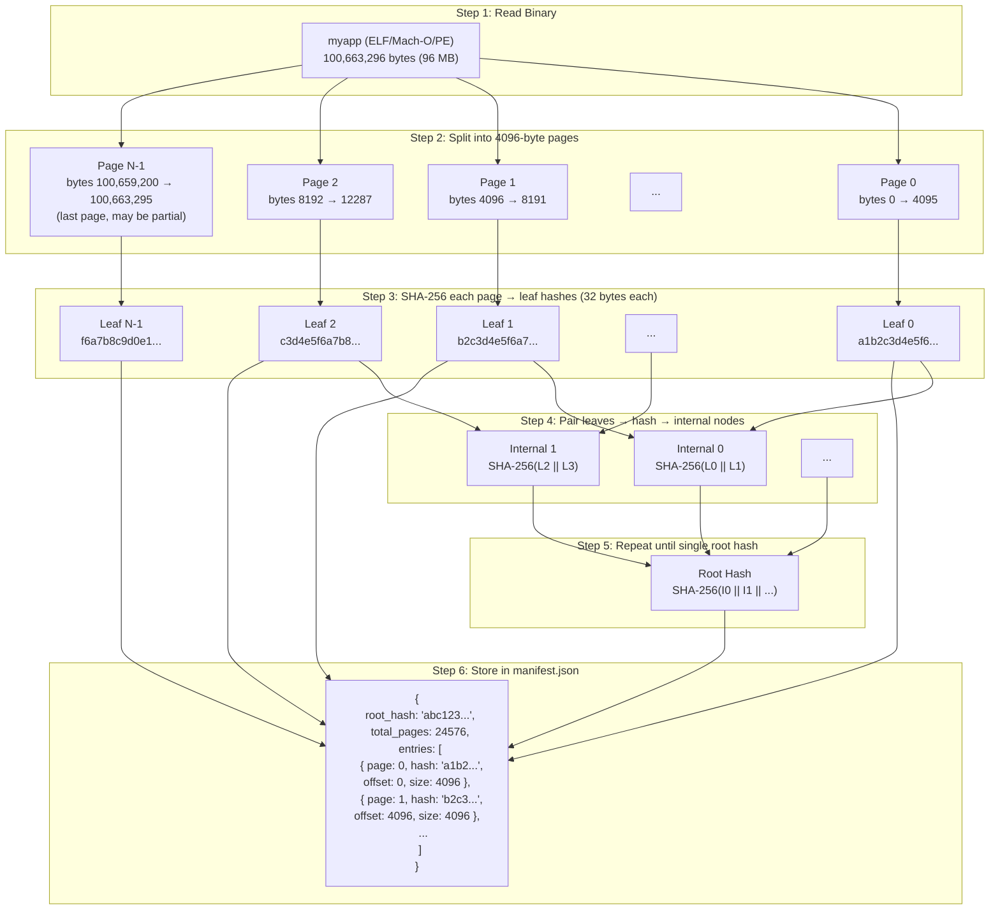
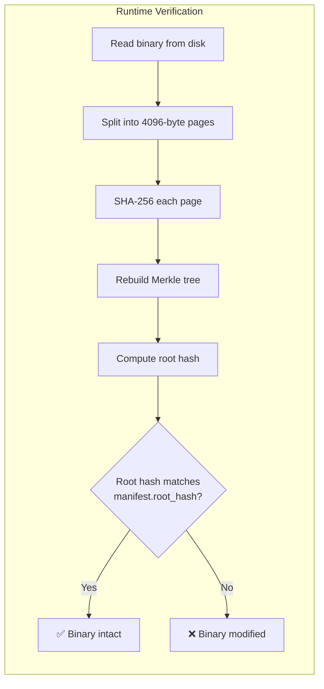

# Merkle Tree

## Overview

A Merkle tree (also known as a hash tree) is a data structure that enables efficient and secure verification of large data sets. RuntimeShield uses Merkle trees for binary integrity verification.

## Structure

```mermaid
graph TB
    subgraph "Level 2 - Root"
        R[Root Hash<br/>hash(H0 + H1)]
    end
    
    subgraph "Level 1 - Internal Nodes"
        H0[Hash 0-1<br/>hash(L0 + L1)]
        H1[Hash 2-3<br/>hash(L2 + L3)]
    end
    
    subgraph "Level 0 - Leaves"
        L0[Leaf 0<br/>hash(Page 0)]
        L1[Leaf 1<br/>hash(Page 1)]
        L2[Leaf 2<br/>hash(Page 2)]
        L3[Leaf 3<br/>hash(Page 3)]
    end
    
    subgraph "Data"
        P0[Page 0<br/>bytes 0-4095]
        P1[Page 1<br/>bytes 4096-8191]
        P2[Page 2<br/>bytes 8192-12287]
        P3[Page 3<br/>bytes 12288-16383]
    end
    
    R --> H0
    R --> H1
    H0 --> L0
    H0 --> L1
    H1 --> L2
    H1 --> L3
    L0 --> P0
    L1 --> P1
    L2 --> P2
    L3 --> P3
```

## Page Hash Creation — Step by Step



### Detailed Walkthrough

**Step 1 — Read the binary**
```
Input:  myapp (96 MB ELF/Mach-O/PE file)
Action: std::fs::read("myapp") → Vec<u8> with 100,663,296 bytes
```

**Step 2 — Split into pages**
```
Action: data.chunks(4096) → iterator of byte slices
Output: 24,576 slices (96 MB / 4096 = 24,576)
         24,575 slices of exactly 4096 bytes
         1 final slice of 4096 bytes or fewer (if file isn't evenly divisible)
```

In Rust:
```rust
let pages: Vec<&[u8]> = data.chunks(4096).collect();
// pages[0]  = &data[0..4096]
// pages[1]  = &data[4096..8192]
// pages[n]  = &data[n*4096 .. min((n+1)*4096, data.len())]
```

**Step 3 — Hash each page into a leaf**
```rust
let leaf_hashes: Vec<[u8; 32]> = data
    .chunks(4096)              // split into 4096-byte pages
    .map(|page| sha2(&page))   // SHA-256 each page → 32-byte hash
    .collect();

// leaf_hashes[0] = SHA-256(page 0 bytes)  → a1b2c3d4...
// leaf_hashes[1] = SHA-256(page 1 bytes)  → b2c3d4e5...
// leaf_hashes[n] = SHA-256(page n bytes)  → f6a7b8c9...
```

Each leaf hash is **32 bytes** (256 bits), the output of SHA-256. The page content itself is variable-length (4096 bytes for full pages, less for the final partial page), but the hash output is always 32 bytes regardless of input size.

**Step 4 — Build the Merkle tree**

Pair adjacent leaves, concatenate their 32-byte hashes (64 bytes total), and hash again:
```rust
// Pair leaves: (0,1), (2,3), (4,5), ...
// For each pair: SHA-256(leaf_hashes[i] || leaf_hashes[i+1])
// If odd number of leaves, promote the unpaired one
```

```
Level 0 (leaves):    [a1b2..., b2c3..., c3d4..., d4e5..., e5f6...]
                         \      /            \      /        |
Level 1 (internal):     SHA-256(64 bytes)   SHA-256(64 bytes)  [e5f6...]
                              \                  /              |
Level 2 (root):               SHA-256(64 bytes)                /
```

**Step 5 — Repeat until one hash remains**

Continue pairing and hashing until a single hash remains — this is the **root hash**.

```
Level 0: 24,576 leaves
Level 1: 12,288 internal nodes
Level 2: 6,144 internal nodes
...
Level n: 1 root hash (24,576 pages → ~15 levels)
```

**Step 6 — Store in manifest**

```rust
Manifest {
    root_hash:  "abc123...",   // hex-encoded root hash (64 chars)
    total_pages: 24576,
    file_size:  100663296,
    entries: [
        ManifestEntry { page_index: 0, page_hash: "a1b2...", offset: 0,     size: 4096 },
        ManifestEntry { page_index: 1, page_hash: "b2c3...", offset: 4096,  size: 4096 },
        // ... 24,574 more entries
    ],
    version: "1.0.0",
}
```

### Byte-Level Summary

```
Binary file (96 MB)
    ↓ split into 4096-byte chunks
24,576 pages (4096 bytes each, last may be smaller)
    ↓ SHA-256 each page
24,576 leaf hashes (32 bytes each = 768 KB total)
    ↓ pair, concatenate, SHA-256
12,288 internal hashes
    ↓ pair, concatenate, SHA-256
...repeat...
    ↓
1 root hash (32 bytes)
    ↓ stored as
manifest.json (~1.5 MB for 96 MB binary)
```

## Verification at Runtime



## Why Merkle Trees?

### Efficiency

- **Full verification**: O(n) — hash all pages → O(log n) parent hashes
- **Page verification**: O(1) — hash single page and compare with leaf hash
- **Storage**: Linear in file size (one hash per page + internal nodes)

### Properties

| Property | Description |
|---|---|
| **Completeness** | Root hash depends on all leaf hashes |
| **Soundness** | Impossible to forge a valid root hash for modified data |
| **Locality** | A single page modification changes only O(log n) hashes |
| **Efficiency** | Each hash is small (32 bytes for SHA-256) |

## Implementation

```rust
use runtimeshield::crypto::merkle::{build_merkle_tree, verify_page_hash};

let data = std::fs::read("app.exe")?;
let tree = build_merkle_tree(&data);

println!("Pages: {}", tree.leaf_count);
println!("Levels: {}", tree.levels);
println!("Root hash: {}", hex::encode(tree.root.hash));

// Verify a specific page
let page_data = &data[0..4096];
assert!(verify_page_hash(&tree, page_data, 0));
```

## Storage Efficiency

For a binary of size S with page size P and hash size H (32 bytes for SHA-256):

| Binary Size | Pages | Leaf Hashes | Internal Hashes | Total Storage |
|---|---|---|---|---|
| 1 MB | 256 | 8 KB | ~8 KB | ~16 KB |
| 10 MB | 2,560 | 80 KB | ~80 KB | ~160 KB |
| 100 MB | 25,600 | 800 KB | ~800 KB | ~1.6 MB |
| 1 GB | 262,144 | 8 MB | ~8 MB | ~16 MB |

## Comparison with Simple Hashing

### Simple Hash (SHA-256 of entire file)

```
hash(entire_file) = 32 bytes
```

**Pros**: Simple, fast to compute, small storage.
**Cons**: Cannot determine which page changed; must re-hash entire file for verification.

### Merkle Tree (page-level)

```
hash(page_0) + hash(page_1) + ... + internal_nodes + root_hash
```

**Pros**: Page-level granularity, efficient partial verification.
**Cons**: More storage, slightly more computation for tree construction.

## Limitations

1. **Page size tradeoff**: Smaller pages give finer granularity but more hashes. 4096 bytes is a good default.

2. **No tamper resistance**: The Merkle tree itself must be protected. A Merkle tree can verify integrity but cannot prevent modification.

3. **Perfect binary tree assumption**: Real data produces unbalanced trees when the page count is not a power of two. RuntimeShield handles this by promoting orphaned nodes.

4. **Hash collision resistance**: Security depends on SHA-256 collision resistance. Currently considered secure.
