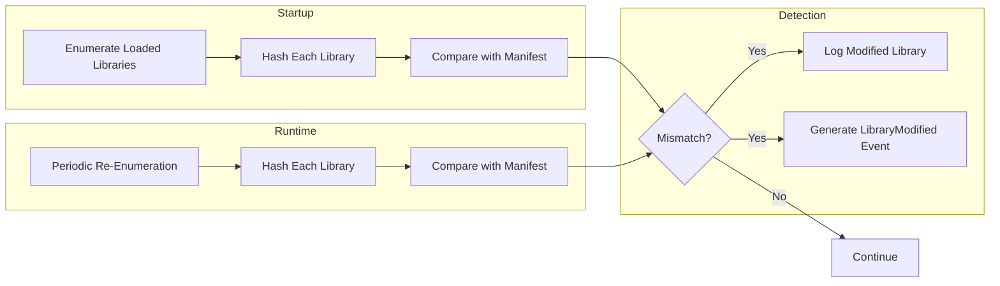

# Library Verification

## Overview

Library verification detects modifications to the shared libraries loaded by the application. Attackers often modify shared libraries (or substitute them) to intercept function calls, steal data, or alter behavior.

## How It Works



## Linux Implementation

On Linux, library enumeration reads `/proc/self/maps`:

```
7f8a00000000-7f8a00021000 r-xp 00000000 08:01 1234567    /usr/lib/libc.so.6
7f8a00021000-7f8a00022000 r--p 00020000 08:01 1234567    /usr/lib/libc.so.6
7f8a00022000-7f8a00023000 rw-p 00021000 08:01 1234567    /usr/lib/libc.so.6
```

Each unique `.so` path is identified, and the file is hashed using SHA-256.

### LD_PRELOAD Detection

The `LD_PRELOAD` environment variable can inject libraries before the application starts. RuntimeShield detects these libraries during startup enumeration and includes them in the hash comparison. If they don't match the expected hash, a `LibraryModified` event is generated.

## macOS Implementation

macOS library enumeration is deferred in the current implementation. The production implementation will use:

- `_dyld_get_image_name()` and `_dyld_get_image_header()` from `<mach-o/dyld.h>`
- Parsing Mach-O load commands for LC_LOAD_DYLIB, LC_LOAD_WEAK_DYLIB
- DYLD_INSERT_LIBRARIES environment variable inspection

## Manifest Format

Libraries are included in a manifest that maps library names to their expected hashes:

```json
[
  {
    "name": "libc.so.6",
    "path": "/usr/lib/x86_64-linux-gnu/libc.so.6",
    "hash": "a1b2c3d4e5f6..."
  },
  {
    "name": "libm.so.6",
    "path": "/usr/lib/x86_64-linux-gnu/libm.so.6",
    "hash": "b2c3d4e5f6a7..."
  }
]
```

## Limitations

1. **Library updates**: When the system updates a library, the hash changes. The manifest must be regenerated or updated.

2. **Same-named, different implementations**: Two libraries with the same name but different implementations will produce different hashes. The manifest must match the target deployment environment.

3. **Dynamic loading**: Libraries loaded after startup via `dlopen` or `LoadLibrary` are not in the initial enumeration. They may or may not be in the manifest.

4. **Kernel-level redirection**: A kernel module could intercept file reads and present a clean version of a modified library.

## Best Practices

1. **Generate library manifests in CI/CD** — Include the target environment's library hashes in your build artifact.

2. **Use versioned library paths** — Libraries with versioned paths (e.g., `libc-2.31.so`) are less likely to change unexpectedly.

3. **Allow for updates** — Plan for library updates and provide a mechanism to update the manifest.

4. **Combine with binary integrity** — Library verification is most effective when combined with binary integrity verification.

5. **Container environments** — In Docker containers, library sets are fixed and predictable, making verification simpler.
