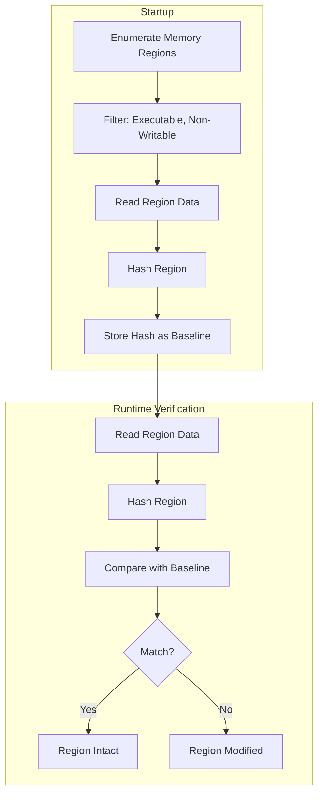

# Memory Integrity

## Overview

Memory integrity verification detects modifications to executable code regions in the application's memory space. This catches in-memory patching, hooking, and code injection attacks.

## How It Works



## Linux Implementation

On Linux, memory regions are enumerated by parsing `/proc/self/maps`:

```
00400000-00401000 r-xp 00000000 08:01 1234567    /usr/bin/myapp
7f8a00000000-7f8a00021000 r-xp 00000000 08:01 1234567    /usr/lib/libc.so.6
7f8a00021000-7f8a00022000 r--p 00020000 08:01 1234567    /usr/lib/libc.so.6
```

Regions with `r-xp` permissions (read-execute, private) are candidates for integrity checking. Writable regions (`rw-`, `rwxp`) are excluded because they contain mutable data.

Memory data is read through `/proc/self/mem` using `pread` with the appropriate offset.

## Region Selection Criteria

| Permission | Included | Reason |
|---|---|---|
| `r-xp` (code) | ✅ Yes | Executable, non-writable |
| `r--p` (ro data) | ⚠️ Optional | Read-only but not executable |
| `rw-p` (data) | ❌ No | Writable, expected to change |
| `rwxp` | ❌ No | Writable and executable (suspicious) |

## Configuration

Memory integrity is enabled via the builder:

```rust
let mut shield = RuntimeShield::builder()
    .enable_memory_integrity()
    .build()?;
```

### Custom Regions

Applications can specify custom memory regions to protect:

```rust
// In a more advanced setup
let mut mem = MemoryIntegrity::new();
mem.add_protected_region(0x401000, 4096); // Custom code section
mem.add_protected_region(0x402000, 8192);
mem.snapshot_hashes()?;
```

## Limitations

### What Memory Integrity Can Detect

- In-memory code patching (changing instruction bytes)
- Detours-style function hooking (modifying prologue)
- Code cave injection
- ROP gadget modification

### What Memory Integrity Cannot Detect

- **Data-only attacks**: Modifications to writable data (variables, vtables) — these are expected to change
- **Hardware breakpoints**: Debug registers (DR0-DR3) are not checked
- **Page table manipulation**: Kernel-level remapping of pages
- **Self-modifying code**: Regions that legitimately change need to be excluded or re-snapshotted
- **JIT-compiled code**: JIT regions are typically writable and excluded

### False Positives

Memory integrity may trigger on:

- **ASLR**: Different runs produce different addresses (but permissions should be the same)
- **Lazy binding**: PLT/GOT resolution changes read-only data
- **Position-independent code**: Relocation at load time
- **Update/patching**: Hot-patching of running code
- **Memory-mapped configuration**: Some applications use r-x regions for data

## Performance

| Binary Size | Regions | Snapshot Time | Verification Time |
|---|---|---|---|
| 10 MB | ~50 | 1-5ms | 1-5ms |
| 100 MB | ~200 | 10-30ms | 10-30ms |
| 500 MB | ~1000 | 50-150ms | 50-150ms |

## Best Practices

1. **Snapshot at the right time** — Take the memory snapshot after all initialization is complete, including library loading and relocation.

2. **Exclude known mutable regions** — If your application uses self-modifying code, JIT, or dynamic code generation, exclude those regions.

3. **Combine with other checks** — Memory integrity is most effective when used alongside binary and library verification.

4. **Handle ASLR** — Addresses change between runs; use relative offsets or region-based matching.

5. **Test on your target platform** — Memory layout varies between OS versions and configurations.
