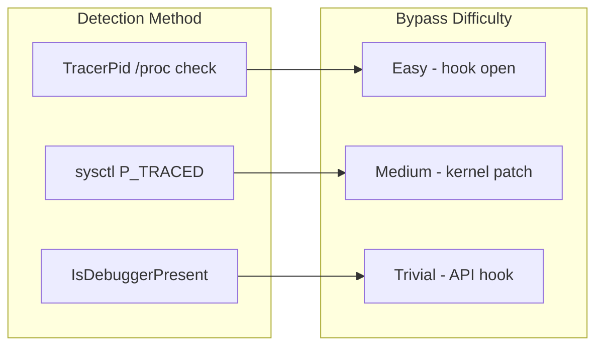

# Anti-Debug

## Overview

Anti-debug detection helps applications detect the presence of debuggers. This is a deterrent, not a prevention — determined attackers can bypass debugger detection.

## Detection Techniques

### Linux

#### TracerPid

The primary Linux detection mechanism reads `/proc/self/status` and checks the `TracerPid` field:

```
Name:   myapp
State:  S (sleeping)
Tgid:   1234
Pid:    1234
PPid:   1
TracerPid:  5678    ← Non-zero means a debugger is attached
```

**How it works**: When a process is being ptraced (by gdb, strace, etc.), the kernel sets `TracerPid` to the PID of the tracing process.

**Limitations**: 
- Can be bypassed by hooking `open()` for `/proc/self/status`
- The tracer can modify the content before the traced process reads it
- Some debuggers can detach temporarily during the read

#### ptrace Self-Trace

Another technique is attempting to `ptrace(PTRACE_TRACEME, ...)`. If the process is already being traced, this call fails.

**Not implemented in V1**: This technique has side effects (it requires a fork in some configurations) and is not currently included.

### macOS

#### sysctl KERN_PROC

On macOS, debugger detection uses the `sysctl` API to check the `P_TRACED` flag on the process's `kinfo_proc` structure:

```c
int mib[4] = { CTL_KERN, KERN_PROC, KERN_PROC_PID, pid };
struct kinfo_proc kinfo;
size_t size = sizeof(kinfo);
sysctl(mib, 4, &kinfo, &size, NULL, 0);
return (kinfo.kp_proc.p_flag & P_TRACED) != 0;
```

**Current status**: Implementation is deferred due to libc API stability considerations across macOS versions. When implemented, this will be the primary detection mechanism.

#### Alternative Techniques (Documented, Not Implemented)

- **Parent process inspection**: Check if parent is a known debugger (lldb, Xcode, etc.)
- **Task port inspection**: Check if the task port has been modified by a debugger
- **Exception ports**: Check for modified exception handlers

### Windows (Architecture)

Windows debugger detection would use:
- `IsDebuggerPresent()` — Basic Win32 API check
- `NtQueryInformationProcess(SystemProcessInformation)` with `ProcessDebugPort`
- `CheckRemoteDebuggerPresent()` — Detect remote debuggers
- `NtSetInformationThread(ThreadHideFromDebugger)` — Prevent debug events

## Detection Reliability



| Technique | Bypass Difficulty | Reliability |
|---|---|---|
| TracerPid (Linux) | Medium | High on unmodified systems |
| sysctl (macOS) | Hard | High (requires kernel access) |
| IsDebuggerPresent (Windows) | Easy | Low (easily hooked) |

## Policy Configuration

When a debugger is detected, the policy engine responds:

```toml
# runtime_policy.toml
DebuggerDetected = "Terminate"
```

Available actions: `Terminate`, `Callback`, `Log`, `Ignore`

## Limitations and Caveats

1. **Not foolproof**: Debugger detection is a cat-and-mouse game. Determined attackers will find ways to bypass it.

2. **False positives**: Some legitimate tools (strace, dtrace, profilers) set TracerPid. Test thoroughly with your development environment.

3. **Compliance monitoring**: Some enterprise security tools attach to processes for monitoring. Anti-debug can conflict with these.

4. **No prevention**: RuntimeShield can detect debuggers but cannot prevent them from attaching.

5. **Timing**: The periodic monitor checks for debuggers at fixed intervals. A debugger could attach and detach between checks.

## Best Practices

1. **Use anti-debug as a deterrent** — Make debugging your application more difficult, not impossible.

2. **Combine with integrity checks** — A debugger that modifies code will be caught by memory integrity, even if anti-debug is bypassed.

3. **Provide a development mode** — Disable anti-debug in development builds to avoid interfering with legitimate debugging.

4. **Test with CI/CD** — Ensure your CI pipeline doesn't trigger false positives.

5. **Document for users** — Inform users that debugger detection is active so they don't file false bug reports about crashes in debug builds.
