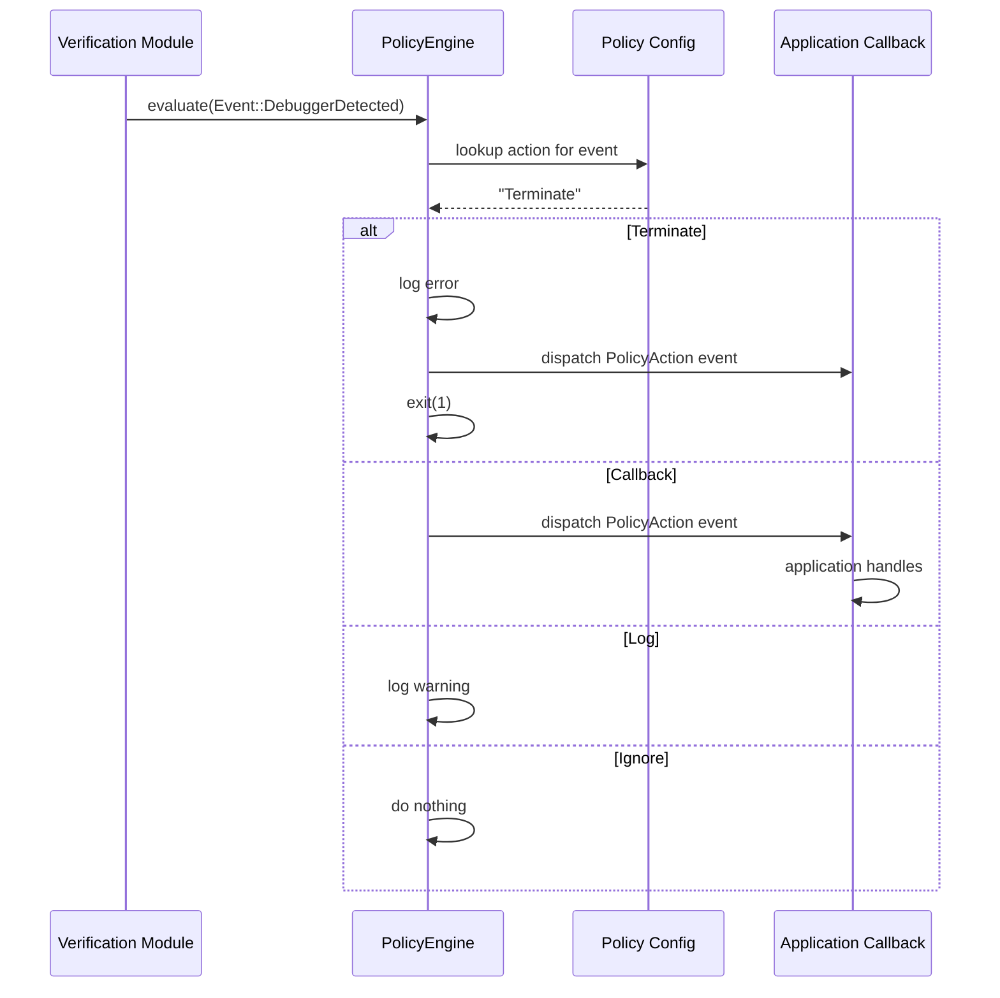
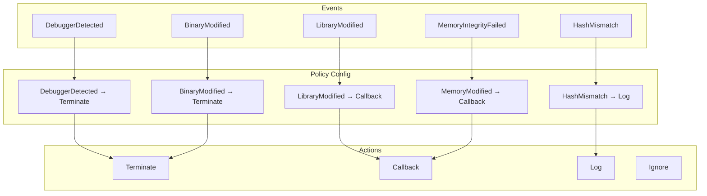

# Policy Engine

## Overview

The policy engine maps security events to actions. It is the decision-making component that determines how RuntimeShield responds to integrity violations.

## Policy File Format

Policies are defined in TOML format:

```toml
# runtime_policy.toml
DebuggerDetected = "Terminate"
BinaryModified = "Terminate"
LibraryModified = "Callback"
HashMismatch = "Log"
MemoryModified = "Callback"
```

### Available Actions

| Action | Behavior |
|---|---|
| `Terminate` | Calls `std::process::exit(1)` after dispatching event |
| `Callback` | Dispatches event to registered callbacks; application decides |
| `Log` | Logs a warning via the `log` crate |
| `Ignore` | Takes no action (event still dispatched) |

### Default Policy

If no policy file is specified, RuntimeShield uses these defaults:

```toml
DebuggerDetected = "Terminate"
BinaryModified = "Terminate"
LibraryModified = "Log"
HashMismatch = "Log"
MemoryModified = "Log"
```

## Policy Flow



## Loading Policies

```rust
// From file
let mut shield = RuntimeShield::builder()
    .policy("runtime_policy.toml")
    .build()?;

// Programmatic (test only)
use runtimeshield::config::policy::PolicyConfig;

let mut shield = RuntimeShield::builder()
    .enable_anti_debug()
    .build()?;
```

## Event-to-Action Mapping



## Design

The policy engine is intentionally stateless:

```rust
pub struct PolicyEngine {
    config: PolicyConfig,
}

impl PolicyEngine {
    pub fn evaluate(&self, event: &Event) -> Action {
        // Look up event in config, return action
    }
}
```

This makes it:
- **Thread-safe**: No mutable state, can be shared across threads
- **Testable**: Easy to unit test with different configurations
- **Predictable**: Same input always produces same output

## Security Considerations

### Terminate vs Callback

`Terminate` is the most aggressive response and should be used carefully:

**Use Terminate when:**
- Debugger is detected
- Binary is modified (cannot be trusted to continue)
- Library with security-critical functionality is modified

**Use Callback or Log when:**
- Non-critical event (informational)
- Application wants to handle the response
- Graceful shutdown is preferred

### Policy Bypass

If an attacker controls the policy file, they can disable protections. Protect the policy file by:

1. **Embedding the default policy** in the binary
2. **Distributing the policy file** securely (signed, proper permissions)
3. **Validating the policy file** against a schema before loading

### Multiple Events

When multiple violations are detected in a single verification cycle, each event is evaluated independently. The most severe action takes precedence in terms of execution order, but all actions are performed.
