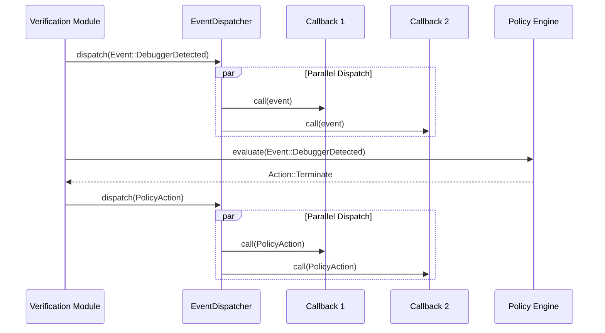
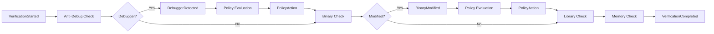

# Event System

## Overview

The event system provides a callback-based mechanism for applications to receive notifications about integrity events and policy actions.

## Event Types

```rust
pub enum Event {
    DebuggerDetected,
    BinaryModified,
    LibraryModified,
    HashMismatch { expected: String, actual: String },
    MemoryIntegrityFailed,
    VerificationStarted,
    VerificationCompleted,
    PolicyAction { event: String, action: String },
    Error { message: String },
    Info { message: String },
}
```

### Event Descriptions

| Event | Trigger | Payload |
|---|---|---|
| DebuggerDetected | Anti-debug check detects a debugger | None |
| BinaryModified | Binary hash does not match manifest | None |
| LibraryModified | Library hash does not match manifest | None |
| HashMismatch | Any hash comparison fails | Expected and actual hashes |
| MemoryIntegrityFailed | Memory region hash mismatch | None |
| VerificationStarted | Verification cycle begins | None |
| VerificationCompleted | Verification cycle ends | None |
| PolicyAction | Policy engine evaluates an event | Event name and action taken |
| Error | Internal error | Error message |
| Info | Informational message | Message text |

## Callback Registration

```rust
use std::sync::Arc;
use runtimeshield::{RuntimeShield, Event};

let mut shield = RuntimeShield::builder()
    .on_event(Arc::new(|event: Event| {
        match event {
            Event::DebuggerDetected => {
                println!("WARNING: Debugger detected!");
            }
            Event::BinaryModified => {
                println!("CRITICAL: Binary has been modified!");
            }
            Event::VerificationStarted => {
                println!("Verification cycle starting...");
            }
            Event::VerificationCompleted => {
                println!("Verification cycle completed.");
            }
            Event::PolicyAction { event, action } => {
                println!("Policy {} → {}", event, action);
            }
            _ => {}
        }
    }))
    .build()?;
```

## Event Flow



## Multiple Callbacks

Multiple callbacks can be registered. They are dispatched in order of registration:

```rust
shield.on_event(Arc::new(|event| {
    // Logger callback
    log::info!("Event: {:?}", event);
}));

shield.on_event(Arc::new(|event| {
    // Metrics callback
    metrics.increment_counter("shield.events", &[("type", &format!("{:?}", event))]);
}));

shield.on_event(Arc::new(|event| {
    // Alert callback
    if matches!(event, Event::DebuggerDetected | Event::BinaryModified) {
        alert_operator(&event);
    }
}));
```

## Threading

Events are dispatched from the thread that triggered them:

- **Startup events**: Main thread (in `start()`)
- **Runtime events**: Background verification thread
- **On-demand events**: Calling thread

Callbacks must be `Send + Sync` because they may be called from any thread.

## Event Ordering



## Best Practices

1. **Keep callbacks fast** — Callbacks are invoked synchronously. Blocking in a callback delays the verification cycle.

2. **Forward events to your logging system** — Integrate RuntimeShield events with your application's logging and monitoring.

3. **Set up alerts for critical events** — `DebuggerDetected` and `BinaryModified` should trigger alerts in production.

4. **Use PolicyAction events** — The `PolicyAction` event tells you what action was taken. Use it for audit logging.

5. **Don't re-enter RuntimeShield from callbacks** — Dispatching a new verification from within a callback could cause re-entrancy issues.
