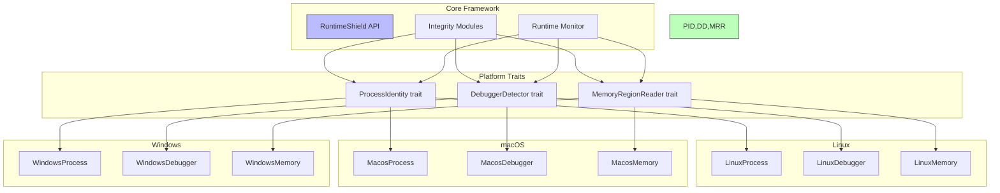

# Cross-Platform Architecture

## Overview

RuntimeShield uses a trait-based platform abstraction layer to support multiple operating systems without changing the core framework.

## Platform Abstraction



## Trait Definitions

```rust
pub trait ProcessIdentity {
    fn process_id(&self) -> u32;
    fn parent_process_id(&self) -> u32;
    fn process_name(&self) -> Result<String>;
    fn executable_path(&self) -> Result<String>;
}

pub trait DebuggerDetector {
    fn is_debugger_present(&self) -> Result<bool>;
    fn debugger_info(&self) -> Result<String>;
}

pub trait MemoryRegionReader {
    fn read_region(&self, address: usize, size: usize) -> Result<Vec<u8>>;
    fn get_code_regions(&self) -> Result<Vec<(usize, usize)>>;
}
```

## Platform Selection

Platform-specific implementations are selected at compile time using `#[cfg]` attributes:

```rust
#[cfg(target_os = "linux")]
pub type PlatformProcess = linux::process::LinuxProcess;

#[cfg(target_os = "macos")]
pub type PlatformProcess = macos::process::MacosProcess;

#[cfg(not(any(target_os = "linux", target_os = "macos")))]
pub type PlatformProcess = windows::WindowsProcess;
```

## Adding a New Platform

To add support for a new platform (e.g., FreeBSD):

1. Create a new module in `src/platform/` (e.g., `freebsd/`)
2. Implement the three traits for that platform
3. Add `#[cfg]` aliases in `src/platform/mod.rs`

No changes to the core framework are needed.

## Platform Support Matrix

| Feature | Linux | macOS | Windows |
|---|---|---|---|
| Process Identity | ✅ Full | ✅ Full | 🚧 Stub |
| Debugger Detection | ✅ Full | ✅ Full | 🚧 Stub |
| Memory Regions | ✅ Full | ✅ Full | 🚧 Stub |
| Library Enumeration | ✅ Full | ✅ Full | 🚧 Stub |

### Legend
- ✅ Full: Production-ready
- 🚧 Stub: Architecture defined, not implemented

## Platform-Specific Dependencies

```toml
# Cargo.toml
[target.'cfg(target_os = "linux")'.dependencies]
procfs = "0.17"

[target.'cfg(target_os = "macos")'.dependencies]
libc = "0.2"
```

These are conditional dependencies that only apply on the respective platform.

## Windows Implementation Plan

The Windows implementation will use:

- **Process Identity**: `GetCurrentProcessId`, `GetModuleFileName`, `NtQueryInformationProcess`
- **Debugger Detection**: `IsDebuggerPresent`, `NtQueryInformationProcess(ProcessDebugPort)`, `CheckRemoteDebuggerPresent`
- **Memory Regions**: `VirtualQueryEx`, `ReadProcessMemory`

Required crate: `windows-sys` or `winapi`

## Cross-Platform Considerations

### /proc Filesystem

Linux relies heavily on `/proc` for process information and memory access. Other platforms use different mechanisms:

| Data | Linux | macOS | Windows |
|---|---|---|---|
| Process ID | `/proc/self/status` | `getpid()` | `GetCurrentProcessId` |
| Parent PID | `/proc/self/status` | `getppid()` | `NtQueryInformationProcess` |
| Executable path | `/proc/self/exe` | `_NSGetExecutablePath` | `GetModuleFileName` |
| Memory maps | `/proc/self/maps` | `mach_vm_region` | `VirtualQuery` |
| Memory read | `/proc/self/mem` | `mach_vm_read` | `ReadProcessMemory` |
| Debugger check | `/proc/self/status TracerPid` | `sysctl P_TRACED` | `IsDebuggerPresent` |

### Error Handling

Platform-specific functions return `Result<T, Error>` using the unified error type:

```rust
pub enum Error {
    Platform(String),
    // ...
}
```

This ensures that platform-specific failures are handled gracefully without crashing the application.
