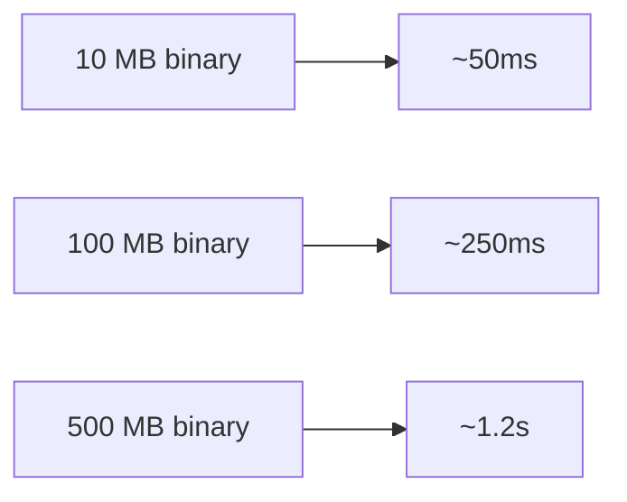
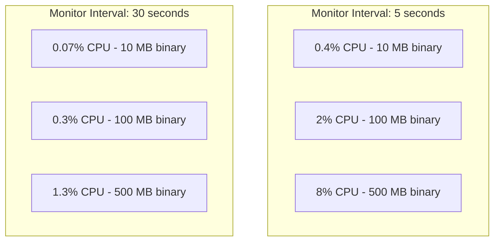

# Performance

## Overview

This document characterizes RuntimeShield's performance characteristics. All measurements are approximate and depend on hardware, binary size, and configuration.

## Startup Time

Time to initialize RuntimeShield and perform startup verification:



### Breakdown

| Operation | 10 MB | 100 MB | 500 MB |
|---|---|---|---|
| Policy loading | <1ms | <1ms | <1ms |
| Library enumeration | 2-5ms | 2-5ms | 2-5ms |
| Binary hashing (full) | 10-20ms | 80-150ms | 400-800ms |
| Merkle tree build | 5-10ms | 30-80ms | 150-500ms |
| Memory region snapshot | 1-5ms | 10-30ms | 50-150ms |
| Total | ~20-40ms | ~120-260ms | ~600-1500ms |

## Runtime Overhead

The runtime monitor runs on a background thread at configurable intervals.

### Per-Cycle Time

| Modules Enabled | 10 MB | 100 MB | 500 MB |
|---|---|---|---|
| Anti-debug only | <1ms | <1ms | <1ms |
| Binary + Library | 15-30ms | 80-200ms | 400-900ms |
| Memory + Anti-debug | 5-15ms | 30-80ms | 100-300ms |
| All modules | 20-50ms | 100-300ms | 500-1200ms |

### CPU Usage



## Memory Usage

| Component | Memory |
|---|---|
| RuntimeShield instance | ~1-5 KB |
| Manifest (in memory) | ~16 KB per 1 MB of binary |
| Merkle tree (in memory) | ~32 KB per 1 MB of binary |
| Memory region hashes | ~32 bytes per region |
| Library hashes | ~32 bytes per library |

### Total Memory by Binary Size

| Binary Size | Manifest | Merkle Tree | Total |
|---|---|---|---|
| 10 MB | ~160 KB | ~320 KB | ~480 KB |
| 100 MB | ~1.6 MB | ~3.2 MB | ~4.8 MB |
| 500 MB | ~8 MB | ~16 MB | ~24 MB |

## Hashing Performance

SHA-256 throughput on various processors:

| Processor | Throughput | 10 MB | 100 MB |
|---|---|---|---|
| Intel i7-12700K (AVX-512) | ~2.5 GB/s | ~4ms | ~40ms |
| AMD Ryzen 7950X (AVX-512) | ~3 GB/s | ~3ms | ~33ms |
| Apple M2 (ARM) | ~2 GB/s | ~5ms | ~50ms |
| Intel Xeon 8375C (AVX-256) | ~1.5 GB/s | ~7ms | ~67ms |

## Recommendations

### For CPU-constrained environments

```rust
RuntimeShield::builder()
    .enable_runtime_monitor()
    .enable_binary_integrity()
    .enable_anti_debug()
    .monitor_interval(30000)  // 30 second intervals
    // Skip library and memory integrity
    .build()?;
```

### For Security-critical environments

```rust
RuntimeShield::builder()
    .enable_startup_verification()
    .enable_runtime_monitor()
    .enable_binary_integrity()
    .enable_library_integrity()
    .enable_memory_integrity()
    .enable_anti_debug()
    .monitor_interval(1000)  // 1 second intervals
    .build()?;
```

## Benchmarking

To measure performance in your specific environment:

1. Check startup verification time
2. Measure runtime verification cycle duration
3. Monitor CPU and memory usage
4. Test with your actual binary size

These measurements will help you select appropriate monitor intervals and module configurations.
