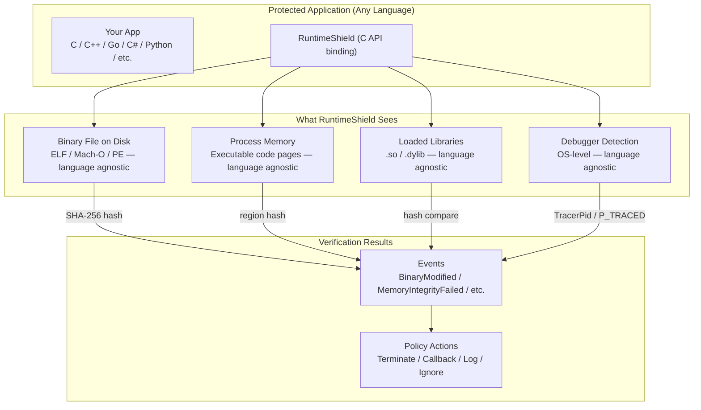
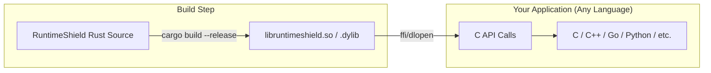
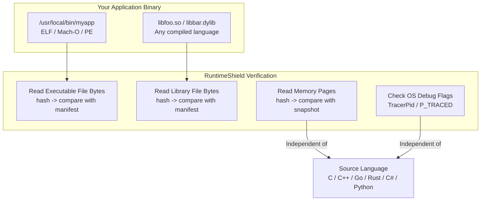

# Integrating RuntimeShield with Any Language or Binary

## Overview

RuntimeShield is written in Rust, but it can protect applications written in **any language** — C, C++, Go, Rust, Python, Java, .NET, or any compiled binary format (ELF, Mach-O, PE). This is because RuntimeShield operates at the **file system and process memory level**, not at the source or IL level.



## Why This Works

RuntimeShield's integrity checks are **language-independent**:

| Check | What It Reads | Language Dependency |
|---|---|---|
| Binary Integrity | Raw file bytes from disk (ELF/Mach-O/PE) | **None** — bytes are bytes |
| Library Integrity | Raw file bytes of .so/.dylib files | **None** — hashing is content-based |
| Memory Integrity | Raw memory pages via /proc/self/mem or mach_vm_read | **None** — reads executable pages |
| Anti-Debug | OS process structures (TracerPid, P_TRACED flag) | **None** — OS-level API |
| Process Identity | /proc filesystem, Mach APIs, libc calls | **None** — OS-level API |

## Integration Methods

### Method 1: C API Shared Library (Recommended)

Compile RuntimeShield as a C-compatible shared library, then link from any language.



#### C Header (`runtimeshield.h`)

```c
#ifndef RUNTIMESHIELD_H
#define RUNTIMESHIELD_H

#include <stdint.h>
#include <stdbool.h>

// Opaque handle to RuntimeShield instance
typedef struct rt_shield_t rt_shield_t;

// Event types
typedef enum {
    RT_EVENT_DEBUGGER_DETECTED = 0,
    RT_EVENT_BINARY_MODIFIED,
    RT_EVENT_LIBRARY_MODIFIED,
    RT_EVENT_HASH_MISMATCH,
    RT_EVENT_MEMORY_INTEGRITY_FAILED,
    RT_EVENT_VERIFICATION_STARTED,
    RT_EVENT_VERIFICATION_COMPLETED,
    RT_EVENT_INFO,
} rt_event_type_t;

// Event callback signature
typedef void (*rt_event_callback_t)(rt_event_type_t type, const char* message);

// Builder methods
rt_shield_t* rt_shield_new(void);
void rt_shield_enable_startup_verification(rt_shield_t* shield);
void rt_shield_enable_runtime_monitor(rt_shield_t* shield);
void rt_shield_enable_binary_integrity(rt_shield_t* shield);
void rt_shield_enable_library_integrity(rt_shield_t* shield);
void rt_shield_enable_memory_integrity(rt_shield_t* shield);
void rt_shield_enable_anti_debug(rt_shield_t* shield);
void rt_shield_set_monitor_interval(rt_shield_t* shield, uint64_t millis);
void rt_shield_set_policy_path(rt_shield_t* shield, const char* path);
void rt_shield_set_manifest_path(rt_shield_t* shield, const char* path);
void rt_shield_on_event(rt_shield_t* shield, rt_event_callback_t callback);

// Lifecycle
int rt_shield_build(rt_shield_t* shield);
int rt_shield_start(rt_shield_t* shield);
void rt_shield_stop(rt_shield_t* shield);
void rt_shield_free(rt_shield_t* shield);

// Verification results
typedef struct {
    bool binary_ok;
    bool library_ok;
    bool memory_ok;
    bool debugger_detected;
    const char** errors;
    int error_count;
} rt_verification_result_t;

int rt_shield_verify_now(rt_shield_t* shield, rt_verification_result_t* result);
void rt_shield_free_result(rt_verification_result_t* result);

#endif // RUNTIMESHIELD_H
```

### Method 2: Dynamic Loading (No Link-Time Dependency)

Use `dlopen` / `dlsym` to load RuntimeShield at runtime. No recompilation needed.

```c
#include <dlfcn.h>
#include <stdio.h>

typedef struct rt_shield_t rt_shield_t;
typedef rt_shield_t* (*rt_shield_new_t)();
typedef int (*rt_shield_start_t)(rt_shield_t*);
typedef int (*rt_verify_now_t)(rt_shield_t*, void*);

int main() {
    void* handle = dlopen("./libruntimeshield.so", RTLD_NOW);
    if (!handle) { fprintf(stderr, "Failed to load: %s\n", dlerror()); return 1; }

    rt_shield_new_t new_fn = (rt_shield_new_t)dlsym(handle, "rt_shield_new");
    rt_shield_start_t start_fn = (rt_shield_start_t)dlsym(handle, "rt_shield_start");

    rt_shield_t* shield = new_fn();
    // configure...
    int result = start_fn(shield);

    dlclose(handle);
    return result;
}
```

### Method 3: Language-Specific Bindings

#### Go

```go
/*
#cgo LDFLAGS: -lruntimeshield
#include "runtimeshield.h"
*/
import "C"
import "unsafe"

func main() {
    shield := C.rt_shield_new()
    defer C.rt_shield_free(shield)

    C.rt_shield_enable_binary_integrity(shield)
    C.rt_shield_enable_anti_debug(shield)

    if ret := C.rt_shield_start(shield); ret != 0 {
        panic("shield start failed")
    }

    var result C.rt_verification_result_t
    if ret := C.rt_shield_verify_now(shield, &result); ret == 0 {
        fmt.Printf("Binary OK: %v\n", bool(result.binary_ok))
    }
}
```

#### Python (via ctypes)

```python
import ctypes

lib = ctypes.cdll.LoadLibrary("./libruntimeshield.so")
lib.rt_shield_new.restype = ctypes.c_void_p
lib.rt_shield_start.restype = ctypes.c_int

shield = lib.rt_shield_new()
lib.rt_shield_enable_binary_integrity(shield)
lib.rt_shield_enable_anti_debug(shield)

if lib.rt_shield_start(shield) == 0:
    print("RuntimeShield protection active")
```

#### Node.js (via ffi-napi)

```javascript
const ffi = require('ffi-napi');

const lib = ffi.Library('./libruntimeshield', {
  'rt_shield_new': ['pointer', []],
  'rt_shield_start': ['int', ['pointer']],
  'rt_shield_enable_binary_integrity': ['void', ['pointer']],
  'rt_shield_free': ['void', ['pointer']],
});

const shield = lib.rt_shield_new();
lib.rt_shield_enable_binary_integrity(shield);
lib.rt_shield_enable_anti_debug(shield);
lib.rt_shield_start(shield);
```

#### .NET (via P/Invoke)

```csharp
using System.Runtime.InteropServices;

class RuntimeShield {
    [DllImport("libruntimeshield")]
    static extern IntPtr rt_shield_new();
    [DllImport("libruntimeshield")]
    static extern int rt_shield_start(IntPtr shield);
    [DllImport("libruntimeshield")]
    static extern void rt_shield_free(IntPtr shield);

    static void Main() {
        var shield = rt_shield_new();
        rt_shield_start(shield);
        // ...
        rt_shield_free(shield);
    }
}
```

## Building the C Library

```bash
# Build shared library for your platform
cargo build --release

# The output is at:
# Linux:   target/release/libruntimeshield.so
# macOS:   target/release/libruntimeshield.dylib
# Windows: target/release/runtimeshield.dll

# Install system-wide
sudo cp target/release/libruntimeshield.* /usr/local/lib/
sudo cp runtimeshield.h /usr/local/include/
```

Add to `Cargo.toml` for C-compatible export:

```toml
[lib]
crate-type = ["lib", "cdylib", "staticlib"]
```

## What Gets Verified (Language-Independent)



## Limitations When Used Cross-Language

| Aspect | Impact |
|---|---|
| **Managed runtimes (.NET, JVM)** | Memory verification checks native code pages, not JIT-managed heaps. JIT code regions are writable and excluded. |
| **Interpreted languages (Python, Ruby)** | The interpreter binary is verified, not the scripts. Memory checks verify the interpreter's code pages. |
| **Static linking** | If you statically link RuntimeShield, the C library approach still works via the same binary. |
| **dlopen loading** | RuntimeShield can be loaded after the application starts — useful for injection into existing processes. |
| **Environment** | The same Linux/macOS platform support applies regardless of the target language. |

## Use Cases

1. **Protect a C++ game binary** — Verify the game executable hasn't been patched
2. **Protect a Go CLI tool** — Guard against binary replacement
3. **Protect a Python application** — Verify the Python interpreter hasn't been tampered with
4. **Protect a .NET service** — Verify the .NET runtime and native assemblies
5. **Protect a containerized app** — Verify binaries in Docker images at startup
6. **Wrap an existing binary** — Use dlopen to add protection without recompilation

## Summary

RuntimeShield is language-agnostic because it operates at the **binary file and process memory level**, not at the source or intermediate language level. Any compiled binary — regardless of what language produced it — can be verified through the same Rust-based C API.
